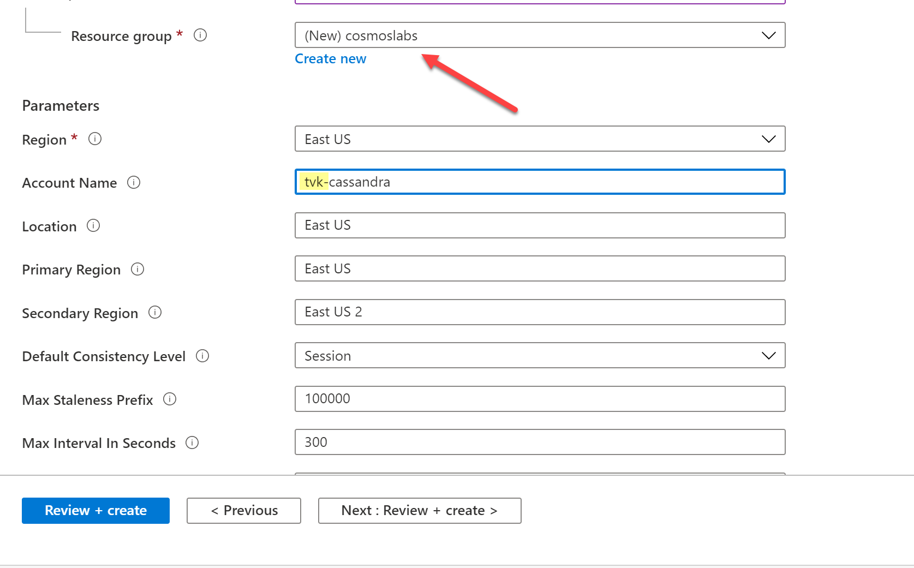

# Account Setup

In this lab, you will setup your Azure subscription with the required resources needed to perform the Cosmos DB labs. The estimated cost to run these labs if you do it in one sitting is ~$100 USD.

## Prerequisites

- Azure Paid Subscription

## Run Setup program

The following resources will be deployed as a part of the setup process:

- Azure Cosmos DB account with Cassandra API enabled
- Cassandra keyspaces (`nutritionkeyspace`, `storekeyspace`) and tables (`foodtable`, `carttable`)
- Azure Databricks Workspace - You will be using this to import data into Azure Cosmos DB

1. Click below to deploy to Azure

2. In the deployment template form that appears, create a new resource group called `cosmoslabs` and add a unique value (e.g. your initials) to the pre-populated account name:

The default name of the Azure Databricks Workspace is `importnutritiondata`. Please update it to add a unique value (e.g. your initials) to the pre-populated name

3. Click `review + create`, and then `create` when the validation has passed. It can take up to 15 minutes for your account to be provisioned and keyspace/tables to be created. You can inspect the ARM template [here](../deploy/azuredeploy.json). 