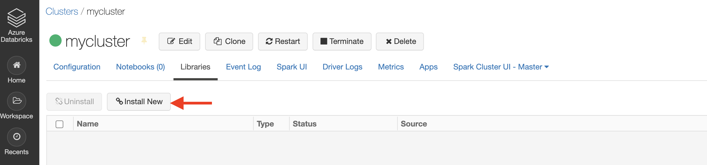

# Load Data Into Cosmos DB with Azure Databricks

In this lab, you will populate an Azure Cosmos DB container from an existing set of data using tools built in to Azure. After importing, you will use the Azure portal to view your imported data.

> If you have not already completed setup for the lab content see the instructions for [Account Setup](00-account_setup.md) before starting this lab.  This will create an Azure Cosmos DB database and container that you will use throughout the lab. You will also use **Azure Databricks** to import existing data into your container.

## Import Lab Data Into Table

You will use **Azure Databricks** to import the JSON data stored in the **nutrition.json** file from Azure Blob Storage.

### Create a Cluster

Follow these steps to create a Databricks cluster.

1. Open your newly created Databricks instance and select **Launch Workspace**.


2. Select **Clusters**


3. Select **Create Cluster**


4. Enter the `Cluster Name`. Leave the other values unchanged


The cluster setup should start and will take a few minutes to complete.


### Install library

In this section, you will install the DataStax Spark Cassandra connector library to your cluster.

Wait for the cluster setup to complete (the `Status` should be `Running`). Select the new cluster, then select **Libraries**


1. Select **Install New**




2. For the library source, select **Maven**. For the coordinates, type `datastax:spark-cassandra-connector:2.4.0-s_2.11` and select **Install**


Wait for the process to complete. The `Status` will change to `Installed`


### Import data

In this section, you will go through the steps to import data into Azure Cosmos DB.

1. In the left navigation, select **Azure Databricks** and **New Notebook**


2. For the name, type **cosmos-import**, leave the `Default Language` as Python and select the cluster you just created. Select `Create`


3. Once the creation is complete, in the first cell of the notebook, type the following

```python
spark.conf.set("spark.cassandra.connection.host","YOURNAME.cassandra.cosmos.azure.com")
spark.conf.set("spark.cassandra.connection.port","10350")
spark.conf.set("spark.cassandra.connection.ssl.enabled","true")
spark.conf.set("spark.cassandra.auth.username","YOURNAME")
spark.conf.set("spark.cassandra.auth.password","YOURPWD")
spark.conf.set("spark.cassandra.connection.factory", "com.microsoft.azure.cosmosdb.cassandra.CosmosDbConnectionFactory")
spark.conf.set("spark.cassandra.output.batch.size.rows", "1")
spark.conf.set("spark.cassandra.connection.connections_per_executor_max", "5")
spark.conf.set("spark.cassandra.output.concurrent.writes", "500")
spark.conf.set("spark.cassandra.concurrent.reads", "256")
spark.conf.set("spark.cassandra.output.batch.grouping.buffer.size", "500")
spark.conf.set("spark.cassandra.connection.keep_alive_ms", "600000000")
```

In the above code, replace `YOURNAME` with your Azure Cosmos DB username and `YOURPWD` with the password. To get this information, visit the Azure Cosmos DB account in the Azure portal.


This is what the notebook will look like once you enter the information in the first cell.


4. Click the **+** sign to add a new cell, type the following

```python
containerName = "nutritiondata"
storageAccountName = "cosmosdblabsv3"
sas = "?sv=2018-03-28&ss=bfqt&srt=sco&sp=rlp&se=2022-01-01T04:55:28Z&st=2019-08-05T20:02:28Z&spr=https&sig=%2FVbismlTQ7INplqo6WfU8o266le72o2bFdZt1Y51PZo%3D"
config = "fs.azure.sas." + containerName+ "." + storageAccountName + ".blob.core.windows.net"

dbutils.fs.mount(
  source = "wasbs://nutritiondata@cosmosdblabsv3.blob.core.windows.net/NutritionData.json",
  mount_point = "/mnt/NutritionData.json",
  extra_configs = {config : sas})

file_location = "/mnt/NutritionData.json"
file_type = "json"
df = spark.read.format(file_type).option("inferSchema", "true").load(file_location)
```

5. Click the **+** sign to add a new cell, type the following

```python
from pyspark.sql import functions as F

lowercasedf = df.select([F.col(x).alias(x.lower()) for x in df.columns])
lowercasedf = lowercasedf.withColumnRenamed("id","foodid")
```

6. Click the **+** sign to add a new cell, type the following

```python
lowercasedf.write.format("org.apache.spark.sql.cassandra").mode('append').options(table="foodcollection", keyspace="importdatabase").save()
```

This is what the notebook will look like once you finish entering the code snippets.


7. Run all the cells one by one, starting with the first one


The data should now be imported in Azure Cosmos DB `foodtable` (in the `nutritionkeyspace`)

## Validate Imported Data

The Azure Cosmos DB Data Explorer allows you to view documents and run queries directly within the Azure Portal. In this exercise, you will use the **Data Explorer** to view the data stored in our table.

You will validate that the data was successfully imported into your table using the **Items** view in the **Data Explorer**.

1. Return to the **Azure Portal** (<http://portal.azure.com>). On the left side of the portal, select the **Resource groups** link. In the **Resource groups** blade, locate and select the **cosmoslabs** resource group. In the **cosmoslabs** blade, select the **Azure Cosmos DB** account you recently created.

2. In the **Azure Cosmos DB** blade, locate and select the **Data Explorer** link on the left side of the blade. In the **Data Explorer** section, expand the **nutritionkeyspace** keyspace node and then expand the **foodtable** table node.


3. Within the **foodtable** node, select the **Rows** link to view a subset of the various rows in the table. Select a few of the documents and observe the properties and structure of the documents.


> If this is your final lab, follow the steps in [Removing Lab Assets](07-cleaning_up.md) to remove all lab resources.

## More Resources

- https://docs.microsoft.com/en-us/azure/cosmos-db/cassandra-spark-create-ops
- https://stackoverflow.com/questions/29924525/failed-to-write-statements/36110970
- https://docs.microsoft.com/en-us/azure/cosmos-db/cassandra-spark-table-copy-ops