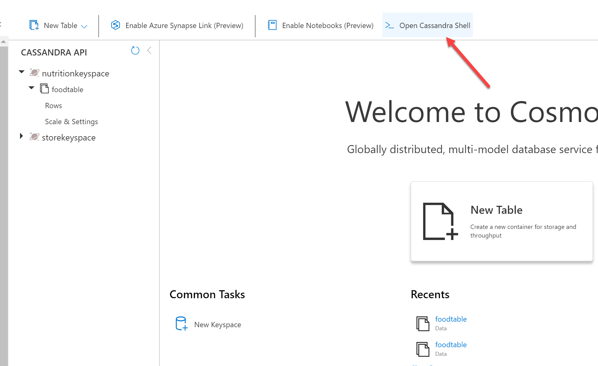
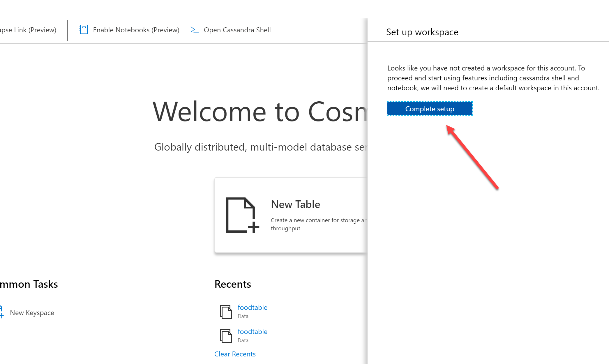
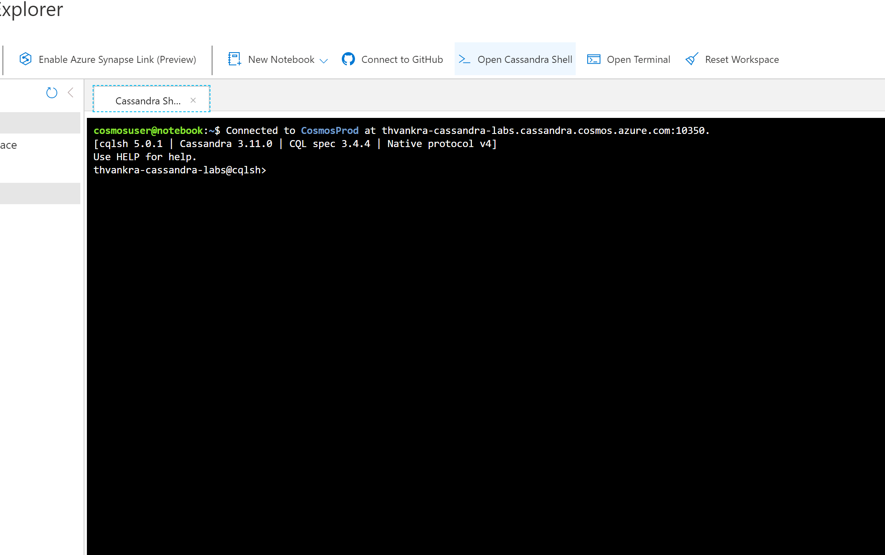

# Querying in Azure Cosmos DB Cassandra API with hosted CQLSH

Azure Cosmos DB Cassandra API accounts provide support for querying items using the Cassandra Query Language (CQL). In this lab, you will explore how to use these rich query capabilities directly through the Azure Portal. No separate tools or client side code are required.

If this is your first lab and you have not already completed the setup for the lab content see the instructions for [Account Setup](00-account_setup.md) before starting this lab.

## Overview

Querying tables with CQL allows Azure Cosmos DB to combine the advantages of Cosmos DB with Cassandra targeted applications.

## Set up hosted CQLSH

First, click on `Open Cassandra Shell`



When clicking on this, you will be prompted to complete setup:



Then, you can click on `Open Cassandra Shell` again to get the hosted shell. 



In the upcoming sections you will make use of the hosted `CQLSH` to run queries and understand the following:

- Data modelling (basics), Partitioning and Secondary Indexes
- Throughput management

## Basic data modelling and related concepts

Say we need to store weather data from different stations all over the country and query them using station ID. 

We can create a table as such:

```sql
CREATE TABLE weather_data (station_id text PRIMARY KEY, temperature int, ts timeuuid)
```

But, this approach will not work for our scenario. As new temperature records flow in, the data for each station will be overwritten. We should use **Compound Primary key**.

### Create Keyspace, Table and seed some data

In `CQLSH` terminal, enter the following queries:

```sql
CREATE KEYSPACE weather WITH REPLICATION = {'class' : 'SimpleStrategy'};

CREATE TABLE weather.data (station_id text, temp int, state text, ts timestamp, PRIMARY KEY (station_id, ts)) WITH CLUSTERING ORDER BY (ts DESC);
```

A combination of `station_id` and `ts` forms the compound primary key, where: 

- `station_id` is the partition key which means that all the data for a specific station will reside within a single partition
- `ts` (`timestamp` type) is the clustering column based on which the rows within each partition will be sorted in descending order

> You can only insert values smaller than 64 kB into a clustering column.


Run the following queries to insert some data:

```sql
INSERT into weather.data (station_id, temp, state, ts) values ('station_1', 70, 'state1', TOTIMESTAMP(NOW()));
INSERT into weather.data (station_id, temp, state, ts) values ('station_2', 71, 'state2', TOTIMESTAMP(NOW()));
INSERT into weather.data (station_id, temp, state, ts) values ('station_3', 72, 'state3', TOTIMESTAMP(NOW()));
INSERT into weather.data (station_id, temp, state, ts) values ('station_2', 73, 'state2', TOTIMESTAMP(NOW()));
INSERT into weather.data (station_id, temp, state, ts) values ('station_3', 74, 'state3', TOTIMESTAMP(NOW()));
INSERT into weather.data (station_id, temp, state, ts) values ('station_3', 75, 'state3', TOTIMESTAMP(NOW()));
```

> `TOTIMESTAMP()` function simply extracts the timestamp `NOW()` generates a new unique `timeuuid`

### Basic queries

Execute some basic queries to fetch data:

```sql
select count(*) as count from weather.data;
select * from weather.data;
```

We can query the table for data corresponding to a particular station since it's a part of the primary key.

```sql
select * from weather.data where station_id = 'station_1';
select * from weather.data where station_id = 'station_2';
select * from weather.data where station_id = 'station_3';
select * from weather.data where station_id IN ('station_1', 'station_2');
```

The clustering key `ts` can be used for range queries:

> while running these queries, please adjust the date/time accordingly to see the expected results

```sql
select * from weather.data where station_id = 'station_3' and ts > TOTIMESTAMP('2020-08-29');
select * from weather.data where station_id IN ('station_1', 'station_2') and ts > TOTIMESTAMP('2020-08-29');
select * from weather.data where station_id = 'station_3' and ts > '2020-08-29 11:30' and ts < '2020-09-02 11:40';
```

### Filter by non-primary key

What if we wanted to query by `state`? Let's try this:

```sql
select * from weather.data where state = 'state1';
```

You will end up with error:

```bash
InvalidRequest: Error from server: code=2200 [Invalid query] message="Cannot execute this query as it might involve data filtering and thus may have unpredictable performance. If you want to execute this query despite the performance unpredictability, use ALLOW FILTERING"
```

It's not advisable to execute filter queries on the columns that aren't partitioned. We can use `ALLOW FILTERING` explicitly, but that results in an operation that may not perform well.

For example:
 
```sql
select * from weather.data where state = 'state1' ALLOW FILTERING;
```

An option is to add an **Index**

### Secondary Index

Unlike the core SQL API, Cassandra API in Azure Cosmos DB does *not* index all attributes by default. Instead, it supports Secondary Indexing to create an index on certain attributes. 

With Cassandra API in Azure Cosmos DB, you do *not* have to provide an index name. A default index with format `<tablename>_<columnname>_idx` is used. 

To create an index;

```sql
CREATE INDEX ON weather.data (state);
```

To check the the index, you can `describe` your table:

```sql
describe table weather.data
```

The last line of the output will have the index - in our case, it is `data_state_idx`


It should be possible to query by state, using `select * from weather.data where state = 'state1'` (without adding `ALLOW FILTERING`)

Please note the following while working with indices in the Cassandra API for Cosmos DB:

- It's not advisable to create an index on a frequently updated column since there is a performance penalty for constantly updating the index
- It is prudent to create an index when you define the table. This ensures that data and indexes are in a consistent state

> In case you create a new index on the existing data, currently, you can't track the index progress change for the table. If you need to track the progress for this operation, you have to request the progress change via a support ticket.

To remove the index, simply use:

```sql
DROP INDEX weather.data_state_idx;
```

### Partitioning

Although we created an index for querying by state, but that should be the last resort since updating all the indexes incurs a performance penalty. A better option is to create a separate table which caters to queries by state. When using Cassandra, one needs to optimize for queries and data duplication is not a concern (as opposed to RDBMS). 

We name our new table `data_by_state`:

```sql
CREATE TABLE weather.data_by_state (station_id text, temp int, state text, ts timestamp, PRIMARY KEY (state, ts)) WITH CLUSTERING ORDER BY (ts DESC);
```

Now we have a compound primary key (just like the previous example) where is the `state` is the partition key and `ts` continues to act as the clustering column that controls sorting within each partition key.

You can insert data:

```sql
INSERT into weather.data_by_state (station_id, temp, state, ts) values ('station_1', 70, 'state1', TOTIMESTAMP(NOW()));
INSERT into weather.data_by_state (station_id, temp, state, ts) values ('station_2', 71, 'state2', TOTIMESTAMP(NOW()));
INSERT into weather.data_by_state (station_id, temp, state, ts) values ('station_3', 72, 'state3', TOTIMESTAMP(NOW()));
INSERT into weather.data_by_state (station_id, temp, state, ts) values ('station_2', 73, 'state2', TOTIMESTAMP(NOW()));
INSERT into weather.data_by_state (station_id, temp, state, ts) values ('station_3', 74, 'state3', TOTIMESTAMP(NOW()));
INSERT into weather.data_by_state (station_id, temp, state, ts) values ('station_3', 75, 'state3', TOTIMESTAMP(NOW()));
```

And execute queries:

> while running these queries, please adjust the date/time accordingly to get the expected results

```sql
select * from weather.data_by_state where state = 'state1';
select * from weather.data_by_state where state IN ('state1', 'state2');

select * from weather.data_by_state where state = 'state3' and ts > toTimeStamp('2020-08-29');
select * from weather.data_by_state where state IN ('state2', 'state3') and ts > toTimeStamp('2020-08-29');

select * from weather.data_by_state where state = 'state1' and ts > '2020-08-29 11:30' and ts < '2020-09-02 12:45';
```

What if we want to find include day as a criteria in addition to the state in order to query for weather data in a state on a given day?

**Composite Partition Key**


The partitions in both the tables (`weather.data` and `weather.data_by_state`) will grow large pretty quickly!

We can optimize this further with a Composite Partition Key. To create the new table `data_state_per_day`:


```sql
CREATE TABLE weather.data_state_per_day (station_id text, temp int, state text, ts timestamp, day date, PRIMARY KEY ((state, day), ts)) WITH CLUSTERING ORDER BY (ts DESC);
```

Now, we have a table where:

- Primary key consists of `state`, `day` and `ts`
- The partition key is a combination of `state` and `day` - this gives us the added benefit of limiting the partition size to a day's worth of data for a particular `state`
- `ts` continues to serve as the clustering column (for sorting records), but in this case it also contributes to the **uniqueness** of each record. Without it, subsequent temperature entries for each state for a given day would be overwritten.

Insert data:

```sql
INSERT into weather.data_state_per_day (station_id, temp, state, ts, day) values ('station_1', 71, 'state1', TOTIMESTAMP(NOW()), toDate(now()));
INSERT into weather.data_state_per_day (station_id, temp, state, ts, day) values ('station_2', 72, 'state2', TOTIMESTAMP(NOW()), toDate(now()));
INSERT into weather.data_state_per_day (station_id, temp, state, ts, day) values ('station_3', 73, 'state3', TOTIMESTAMP(NOW()), toDate(now()));
INSERT into weather.data_state_per_day (station_id, temp, state, ts, day) values ('station_1', 74, 'state2', TOTIMESTAMP(NOW()), toDate(now()));
INSERT into weather.data_state_per_day (station_id, temp, state, ts, day) values ('station_2', 75, 'state3', TOTIMESTAMP(NOW()), toDate(now()));
INSERT into weather.data_state_per_day (station_id, temp, state, ts, day) values ('station_3', 76, 'state3', TOTIMESTAMP(NOW()), toDate(now()));
```

Now, we will need to specify **both** the partition keys (`state` and `day`) to query records;

```sql
select * from weather.data_state_per_day where state = 'state1' and day = '2020-09-02';
select * from weather.data_state_per_day where state IN ('state3', 'state2') and day = '2020-09-02' ;
```

## Throughput Management

You can manage throughput either manually or using Autoscale. In both the cases, it's possible to use `CQL ALTER` commands to configure Request Units (RU/s) at the keyspace or table level.

### Manual throughput mode

In Cassandra API for Cosmos DB, the `Keyspace` and `Table` have an *extra* option named `cosmosdb_provisioned_throughput` which defaults to a minimum value of 400 RU/s (if not specified). 

You can create a keyspace with a specific value for `cosmosdb_provisioned_throughput`, it would be shared with **all** the tables in that keyspace. For example:

```sql
CREATE KEYSPACE testkeyspace1 WITH REPLICATION = {'class' : 'SimpleStrategy'} AND cosmosdb_provisioned_throughput=2000;

ALTER KEYSPACE testkeyspace1 WITH cosmosdb_provisioned_throughput=3000;
```

Update throughput for an existing keyspace:

```sql
ALTER KEYSPACE weather WITH cosmosdb_provisioned_throughput=600;
```

You'll get an error:

```bash
InvalidRequest: Error from server: code=2200 [Invalid query] message="Cannot set provisioned throughput for database that is not configured for shared throughput"
```

The error is self-explanatory - it occurred since the `weather` keyspace that we had created was not covered did *not* have shared throughput configuration

To update throughput of an existing table (e.g. the `weather.data` table we created earlier):

```sql
ALTER TABLE weather.data WITH cosmosdb_provisioned_throughput=1000;
```

### Autoscale mode

You can use Autoscale if your system's scale requirements are unpredictable. All you need to do is set the maximum throughput limit (`Tmax`) and Cosmos DB scales the throughput `T` such that `0.1*Tmax <= T <= Tmax`. `CQL` can be used to set the `cosmosdb_autoscale_max_throughput` option to regulate the maximum threshold for Autoscale.

To set it at the Keyspace level:

```sql 
CREATE keyspace testkeyspace2 WITH cosmosdb_autoscale_max_throughput=6000;
```

> The same applies to tables as well

**Common error scenarios**

Try to update the threshold for the keyspace you just created:

```sql
ALTER keyspace testkeyspace2 WITH cosmosdb_autoscale_max_throughput=400;
```

You'll get an error as such:

```bash
{"Errors":["The offer should have valid throughput values between 4000 and 1000000 inclusive in increments of 1000."]}
```

As clearly stated in the error message, the throughput range (for Autoscale) between is `4000` to `1000000` RU/s and can be increased or decreased in increments of `1000` RU/s.

To update the throughput for an existing table:

```sql
ALTER TABLE weather.data WITH cosmosdb_autoscale_max_throughput=5000;
```

You should see an error similar to this:

```bash
Reason: (Message: {"Errors":["x-ms-cosmos-migrate-offer-to-autopilot must be supplied and offercontent must not contain autopilotSettings for migration from manual throughput to autoscale."]}
```

That's because it's currently not possible to switch from manual to autoscale mode using CQL or any other method except the Azure portal.

**Query Costs**

In Azure Cosmos DB the cost of each operation is represented in the form of Request Units. It is possible to get the query cost for each query programmatically. This is made possible *Custom Payloads* supported in [CQL v4.0](https://github.com/apache/cassandra/blob/trunk/doc/native_protocol_v4.spec). A Custom payloads is generic key-value map where keys are strings and each value is an arbitrary sequence of bytes. Currently, payloads can be sent by clients along with all QUERY, PREPARE, EXECUTE and BATCH requests. 

Cassandra API for Azure Cosmos DB includes a key named `RequestCharge` with each custom payload that is sent as a response to an operation. With the [Cassandra Java driver](https://docs.datastax.com/en/developer/java-driver/3.10/), you can retrieve the incoming custom payload by calling the `getExecutionInfo()` method on a `ResultSet` object. Here is an example how you might use it:

```java
Session cassandraSession = getSession();
SimpleStatement stmt = new SimpleStatement("select * from ordersapp.orders LIMIT 100");
ResultSet results = cassandraSession.execute(stmt);
Map<String, ByteBuffer> payload = results.getExecutionInfo().getIncomingPayload();
System.out.println("RU/s consumed for this query: " + payload.get("RequestCharge").getDouble());
```
   
## Clean up

We created a bunch of keyspaces. To delete them (and the tables):

```bash
DROP KEYSPACE weather;
DROP KEYSPACE testkeyspace1;
DROP KEYSPACE testkeyspace2;
```

## More Resources

- Secondary Index - https://docs.microsoft.com/en-us/azure/cosmos-db/cassandra-secondary-index
- Composite Primary Key - https://docs.microsoft.com/en-us/azure/cosmos-db/cassandra-partitioning
- Autoscale concepts - https://docs.microsoft.com/en-us/azure/cosmos-db/provision-throughput-autoscale
- Autoscale with Cassandra API - https://docs.microsoft.com/en-us/azure/cosmos-db/manage-scale-cassandra#use-autoscale
- Supported CQL commands - https://docs.microsoft.com/en-us/azure/cosmos-db/cassandra-support#cql-commands
- https://docs.microsoft.com/en-us/azure/cosmos-db/consistency-levels-across-apis#cassandra-mapping
- https://docs.datastax.com/en/dse/6.0/cql/cql/cqlAbout.html
- https://docs.datastax.com/en/cql-oss/3.3/cql/cql_using/useMultIndexes.html