# Azure Cosmos DB Cassandra API - Change Feed

## Introduction

Change feed support in the Azure Cosmos DB API for Cassandra is available through the query predicates in the Cassandra Query Language (CQL). Using these predicate conditions, you can query the change feed API. Applications can get the changes made to a table using the primary key (also known as the partition key) as is required in CQL and can then take further actions based on the results. Changes to the rows in the table are captured in the order of their modification time and the sort order is guaranteed per partition key.

Here is the query used to get a change feed on all the rows in a Cassandra API table. Notice the `COSMOS_CHANGEFEED_START_TIME()` predicate that is used directly within CQL to query items in the change feed from a specified start time (in this case current datetime). The paging state is used to ensure that the query resumes at the last point changes were read.

```java
private static String CHANGE_FEED_QUERY = "SELECT * FROM ordersapp.orders where COSMOS_CHANGEFEED_START_TIME()='"+ formatter.format(LocalDateTime.now()) + "'";
```

This translates to the following query at runtime:

```sql
SELECT * FROM ordersapp.orders where COSMOS_CHANGEFEED_START_TIME()='2020-08-21 10:33:17'
```

## Overview

To demonstrate the Change Feed feature, this lab makes use of the following components:

1. Orders Service: A REST API using Spring Data Cassandra that allows you to create and delete orders.
2. Power BI [Streaming Dataset](https://docs.microsoft.com/en-us/power-bi/connect-data/service-real-time-streaming) and [Dashboard](https://docs.microsoft.com/en-us/power-bi/create-reports/service-dashboards): Acts as a sink for orders and provides (near real-time) dashboard with statistics such as number of orders, average order price, total purchase order per location.
3. Change Feed Processor Service: A standalone Java service that detects changes to orders in Cosmos DB (using Change Feed) and uses the [Power BI REST API](https://docs.microsoft.com/en-us/power-bi/connect-data/service-real-time-streaming#using-power-bi-rest-apis-to-push-data) to submit this data for the dashboards to reflect latest information.

## Setup Power BI streaming dataset

Log into your Power BI account. Go to your workspace. select **Create** and choose **Streaming dataset**

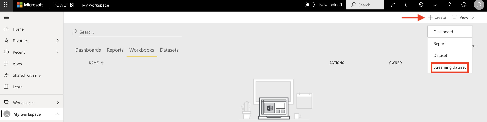

Choose **API** as the source and click **Next** to proceed

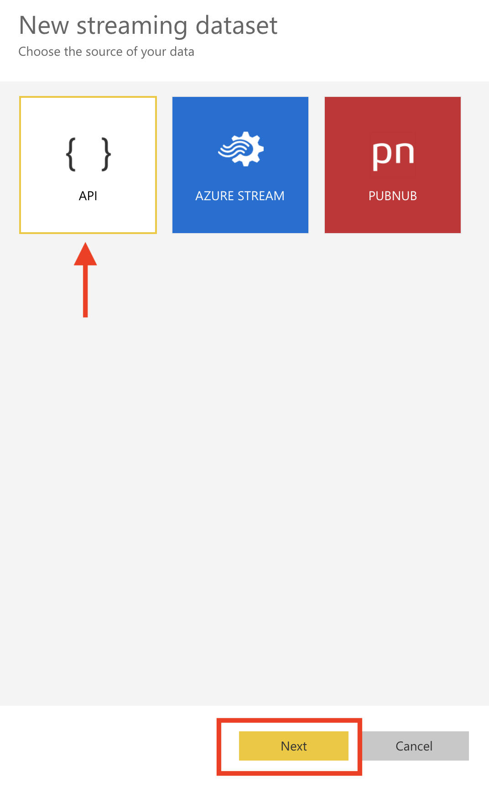

Enter the dataset name, the properties and respective data types. Make sure you activate **Historic data analysis** and click **Create**.

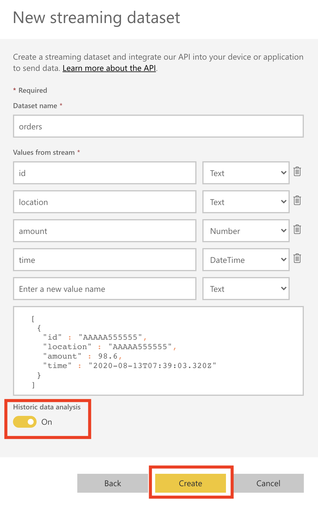

Once the dataset if created, you will see a confirmation screen as such. Please copy the **Push URL** value

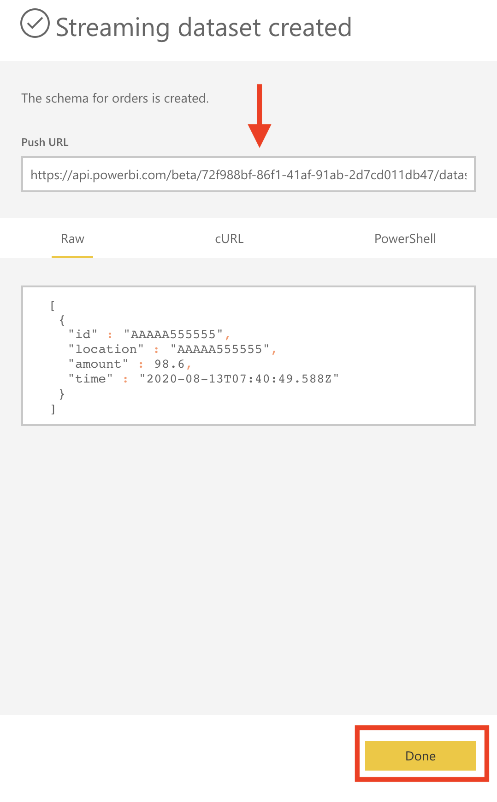


## Configure and start Orders API service

Clone the repository

```bash
git clone https://github.com/TheovanKraay/cassandra-workshops/
```

Create keyspace called `ordersapp` in CosmosDB. In the Azure Portal, open your Cosmos DB account, select **Data Explorer**. From the **New Table** menu, choose **New Keyspace**


Enter `ordersapp` as the name and click **OK** to proceed.


Update the `application.properties` located in `cassandra-wokrshops/labs/java/solutions/Lab04/orders-spring-data/src/main/resources`:

```properties
spring.data.cassandra.keyspace-name=ordersapp
spring.data.cassandra.schema-action=CREATE_IF_NOT_EXISTS
spring.data.cassandra.ssl=true
spring.data.cassandra.contact-points=<cosmos account name>.cassandra.cosmos.azure.com
spring.data.cassandra.port=10350
spring.data.cassandra.username=<cosmos account name>
spring.data.cassandra.password=<cosmos access key>
#ssl_keystore_file_path=<path to keystore e.g. /Library/Java/JavaVirtualMachines/jdk1.8.0_221.jdk/Contents/Home/jre/lib/security/cacerts>
#ssl_keystore_password=<keystore password>
#cosmos_retry_read_dc=East US 2
#cosmos_retry_write_dc=East US
```

Note on optional fields:

- `ssl_keystore_file_path`: Enter the path to your keystore file. The default value is `<JAVA_HOME>/jre/lib/security/cacerts`
- `ssl_keystore_password`: Enter the keystore password. The default value is `changeit`
- `cosmos_retry_read_dc` - Cosmos DB region for read. Default value is `West US`
- `cosmos_retry_write_dc` - Cosmos DB region for write. Default value is `West US`

To start the application:

```shell
cd cassandra-workshops/labs/java/solutions/Lab04/orders-spring-data
mvn clean package
java -jar target/orders-spring-data-0.1.0-SNAPSHOT.jar
```

> The `orders` table will be automatically created when the service is started for the first time

You should see logs similar to this:

```bash
.......

INFO 54373 --- [           main] s.w.s.m.m.a.RequestMappingHandlerMapping : Mapped "{[/error],produces=[text/html]}" onto public org.springframework.web.servlet.ModelAndView org.springframework.boot.autoconfigure.web.servlet.error.BasicErrorController.errorHtml(javax.servlet.http.HttpServletRequest,javax.servlet.http.HttpServletResponse)
INFO 54373 --- [           main] o.s.w.s.handler.SimpleUrlHandlerMapping  : Mapped URL path [/webjars/**] onto handler of type [class org.springframework.web.servlet.resource.ResourceHttpRequestHandler]
INFO 54373 --- [           main] o.s.w.s.handler.SimpleUrlHandlerMapping  : Mapped URL path [/**] onto handler of type [class org.springframework.web.servlet.resource.ResourceHttpRequestHandler]
INFO 54373 --- [           main] o.s.j.e.a.AnnotationMBeanExporter        : Registering beans for JMX exposure on startup
INFO 54373 --- [           main] o.s.b.w.embedded.tomcat.TomcatWebServer  : Tomcat started on port(s): 8080 (http) with context path ''
INFO 54373 --- [           main] c.m.azure.samples.spring.Application     : Started Application in 13.509 seconds (JVM running for 13.892)
```

## Configure and start Orders Change Feed processor service

This is standalone service which listens to changes in the `orders` table in the `ordersapp` keyspace. It shows how to get a change feed on all the rows in a Cassandra API Keyspace table. The predicate `COSMOS_CHANGEFEED_START_TIME()` is used directly within CQL to query items in the change feed from a specified start time.

Update the `config.properties` file located in `cassandra-wokrshops/labs/java/solutions/Lab04/orders-changefeed-processor/src/main/resources`:

```properties
cassandra_host=<cosmos account>.cassandra.cosmos.azure.com
cassandra_port=10350
cassandra_username=<cosmos account>
cassandra_password=<cosmos access key>
power_bi_url=<Power BI streaming dataset Push URL>
#ssl_keystore_file_path=<path to keystore e.g. /Library/Java/JavaVirtualMachines/jdk1.8.0_221.jdk/Contents/Home/jre/lib/security/cacerts>
#ssl_keystore_password=<keystore password>
```

Note on optional fields:

- `ssl_keystore_file_path`: Enter the path to your keystore file. The default value is `<JAVA_HOME>/jre/lib/security/cacerts`
- `ssl_keystore_password`: Enter the keystore password. The default value is `changeit`

## Create new orders

Create new orders using the Orders Spring Data service:

```shell
curl -s -d '{"amount":"400", "location":"NY"}' -H "Content-Type: application/json" -X POST http://localhost:8080/orders
curl -s -d '{"amount":"200", "location":"SanJose"}' -H "Content-Type: application/json" -X POST http://localhost:8080/orders
```

**Check Cosmos DB**

Confirm that the order data was stored in Cassandra. Go to your Cosmos DB account, choose **Data Explorer**, select **ordersapp > orders > Rows**


The change event processor service will detect these orders and send them to Power BI. You can continue to create orders manually or run this script to create orders in bulk:

```bash
chmod a+x generator.sh
./generator.sh
```

Let the script run for a while to ensure that the Power BI streaming dataset has substantial data. You can move on and configure the Power BI dashboard:

## Configure Power BI Dashboard

In your Power BI workspace, click **Create** and choose **Dashboard**

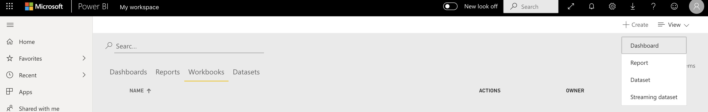

Enter the dashboard name (for example `orders-dashboard`) and choose **Create**

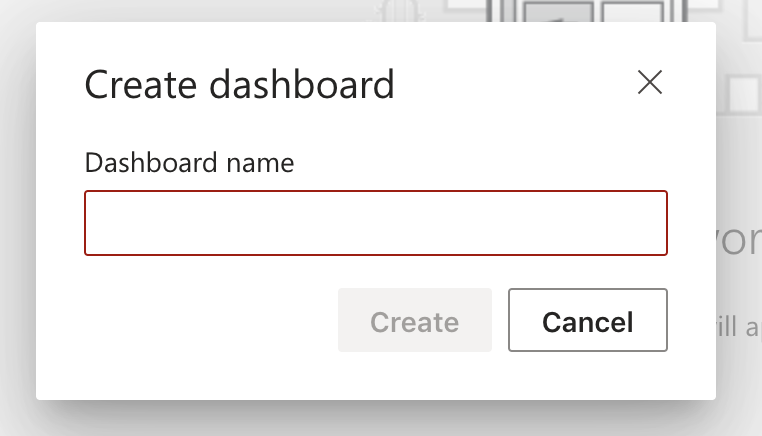

Add a visual component. Choose **+ Add Tile**

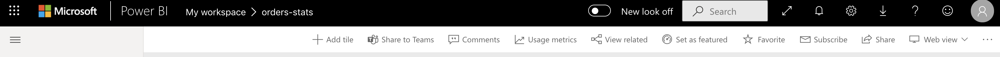

Choose **REAL-TIME DATA (Custom Streaming Data)**

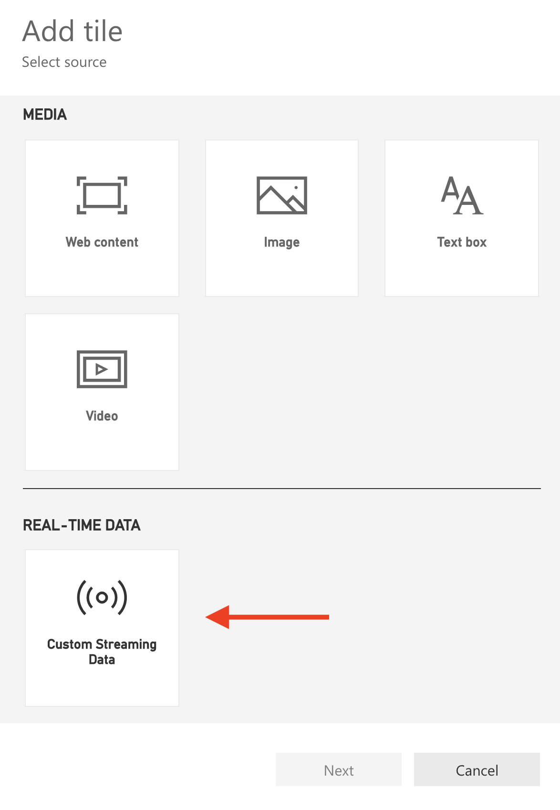

Choose the `orders` dataset you created before

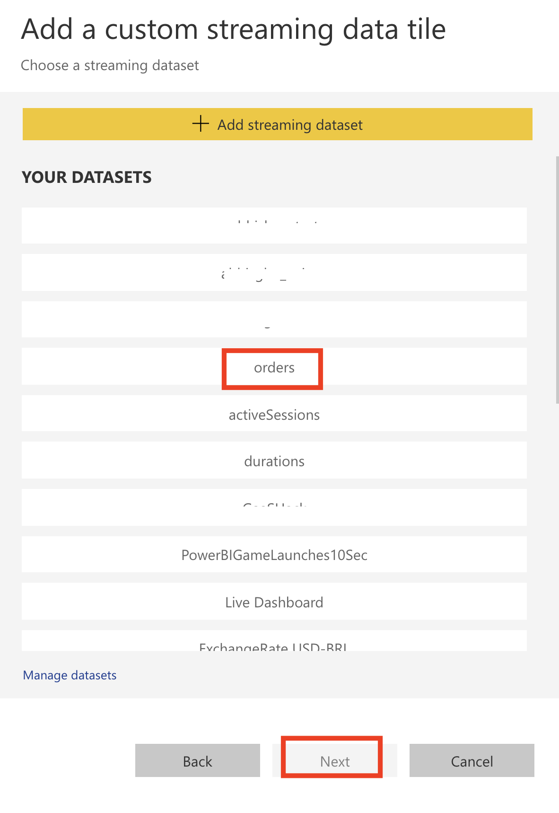

Add a custom tile as below

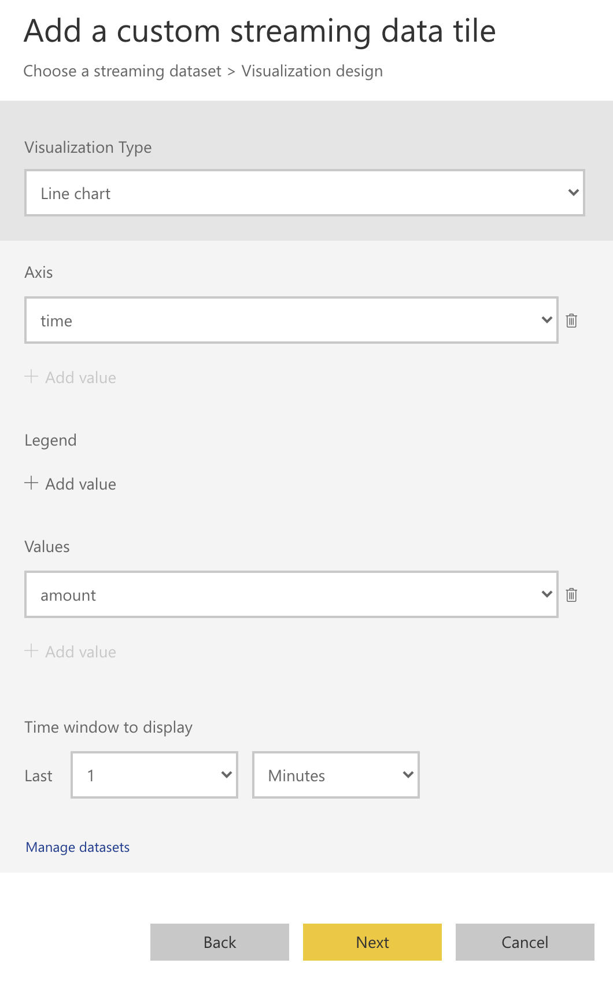

Enter a title and click **Apply**

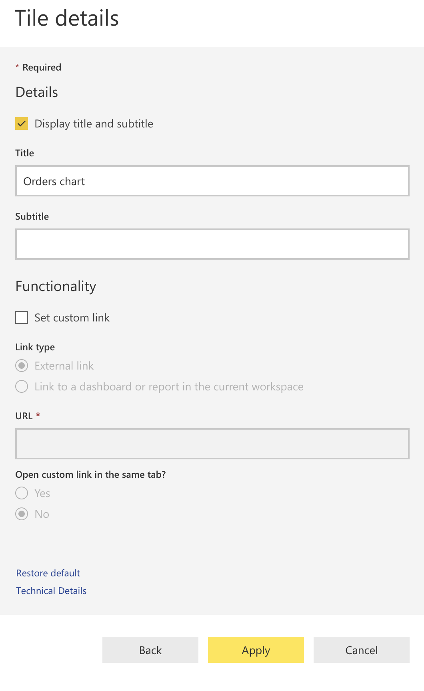

On your dashboard, choose **Ask a question about your data**

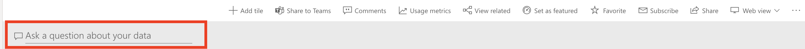

You will see the following options

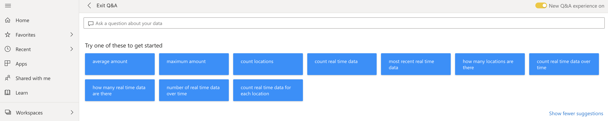

In the text box, enter the following query and select **Pin visual**

`number of data by location` - this will show you the number of orders per city

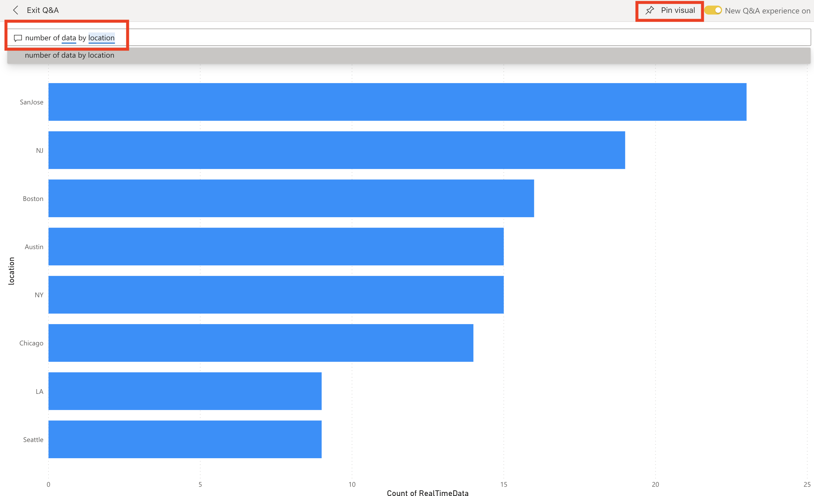

Repeat the previous step for these queries:

- `total data` - will provide total no. of orders so far
- `total amount` - will provide total sales so far
- `sum of data by location` - total no. of orders per city
- `sum of amount by location` - total sales per city
- `average amount by location` - average sales per city

As live data flows into Power BI streaming dataset through the Change Feed Processor service, you should see the dashboard update in real-time.

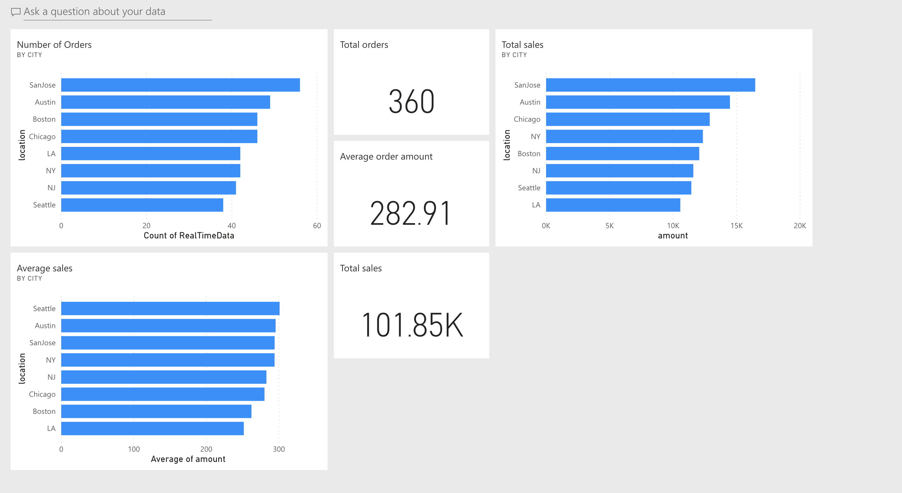

> If this is your final lab, follow the steps in [Removing Lab Assets](07-cleaning_up.md) to remove all lab resources.

## Additional Resources

- https://docs.microsoft.com/en-us/azure/cosmos-db/cassandra-change-feed
- https://devblogs.microsoft.com/cosmosdb/announcing-change-feed-support-for-azure-cosmos-dbs-cassandra-api/
- https://github.com/Azure-Samples/azure-cosmos-db-cassandra-change-feed