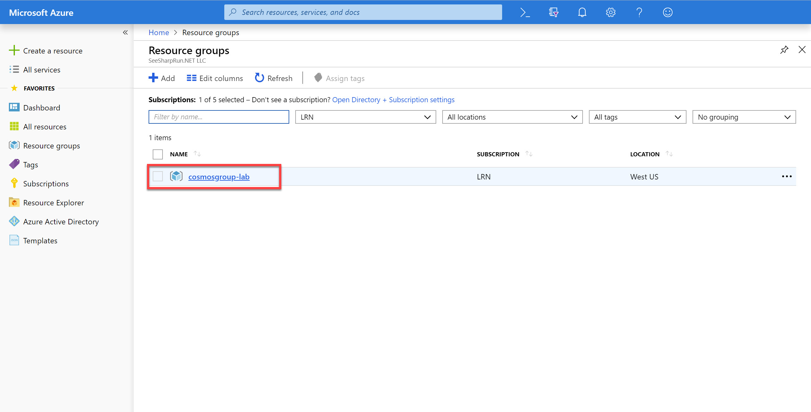
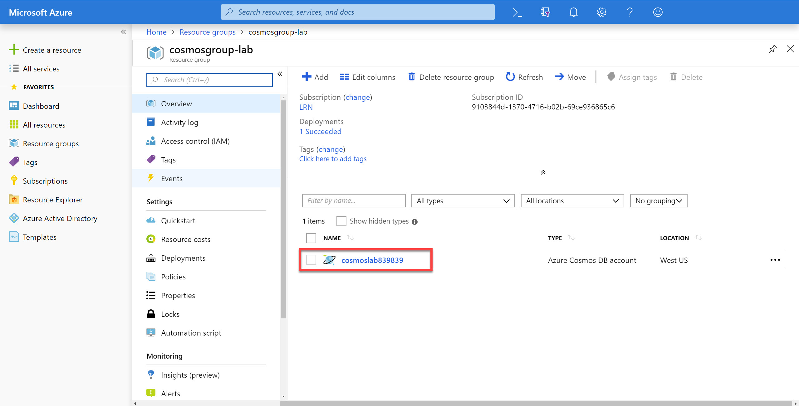
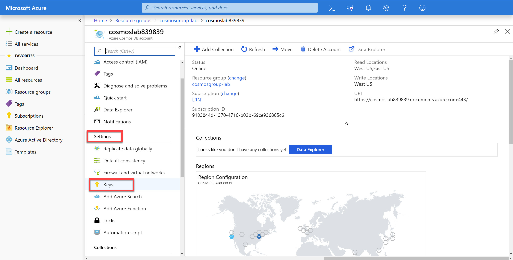

# Account Setup

In this lab, you will setup your Azure subscription with the required resources needed to perform the Cosmos DB labs. The estimated cost to run these labs if you do it in one sitting is ~$100 USD.

## Prerequisites

- Azure Paid Subscription
- [Azure PowerShell Module](https://docs.microsoft.com/en-us/powershell/azure/install-az-ps)

## Lab Content Setup

1. To begin setup, Git clone or download the repo containing these instructions from [Github](https://github.com/AzureCosmosDB/labs).

2. Open Windows Powershell
3. Navigate to the folder containing your downloaded copy of the repo
4. Inside the repo, navigate to the **dotnet\setup** folder:

   ```powershell
   cd .\dotnet\setup\
   ```

5. To enable the setup scripts to run in your current Powershell session, enter the following:

   ```powershell
   Set-ExecutionPolicy Unrestricted -Scope Process
   ```

   > This setting will only apply within your current Powershell window.

6. Many of the labs refer to pre-built code to use as a starting point for the lab instructions. To automatically copy this starter code for the labs into a **CosmosLabs** folder in your **Documents** folder run the labCodeSetup.ps1 script:

   ```powershell
   .\labCodeSetup.ps1
   ```

   > The starter code for each lab is located inside the **templates** folder. To use a folder other that **Documents\CosmosLabs** for your lab code, the files can be copied manually instead.

7. To begin Azure resource setup, first connect to your Azure account:

   ```powershell
   Connect-AzAccount
   ```

   or

   ```powershell
   Connect-AzAccount -subscription <subscription id>
   ```

8. To create the Azure resources for the labs run the labSetup.ps1 script:

   ```powershell
   .\labSetup.ps1
   ```

   - This script creates resources in the _West US_ region by default. To use another region add **-location 'region name'** to the above command.

   - By default this script uses _cosmoslabs_ as the name of the resource group. You can use another name by adding **-resourceGroupName 'name'** to the above command

   - This script will fail if the specified resource group already exists. To bypass this failure and create the resources anyway, add **-overwriteGroup** to the above command.

9. Some Azure resources can take 10 minutes or more to complete setup so expect the script to run for a while before completing. After the script completes, your account should contain a **cosmoslabs** resource group with several pre-configured resources:

   - Azure CosmosDB Account
   - Stream Analytics Job
   - Azure Data Factory
   - Event Hubs Namespace

## Log-in to the Azure Portal

1. In a new window, sign in to the **Azure Portal** (<https://portal.azure.com>).

1. Once you have logged in, you may be prompted to start a tour of the Azure portal. You can safely skip this step.

### Retrieve Account Credentials

The .NET SDK requires credentials to connect to your Azure Cosmos DB account. You will collect and store these credentials for use throughout the lab.

1. On the left side of the portal, select the **Resource groups** link.

   

1. In the **Resource groups** blade, locate and select the **cosmoslabs** _Resource Group_.

   

1. In the **cosmoslabs** blade, select the **Azure Cosmos DB** account you recently created.

   

1. In the **Azure Cosmos DB** blade, locate the **Settings** section and select the **Keys** link.

   

1. In the **Keys** pane, record the values in the **CONNECTION STRING**, **URI** and **PRIMARY KEY** fields. You will use these values later in this lab.

   
