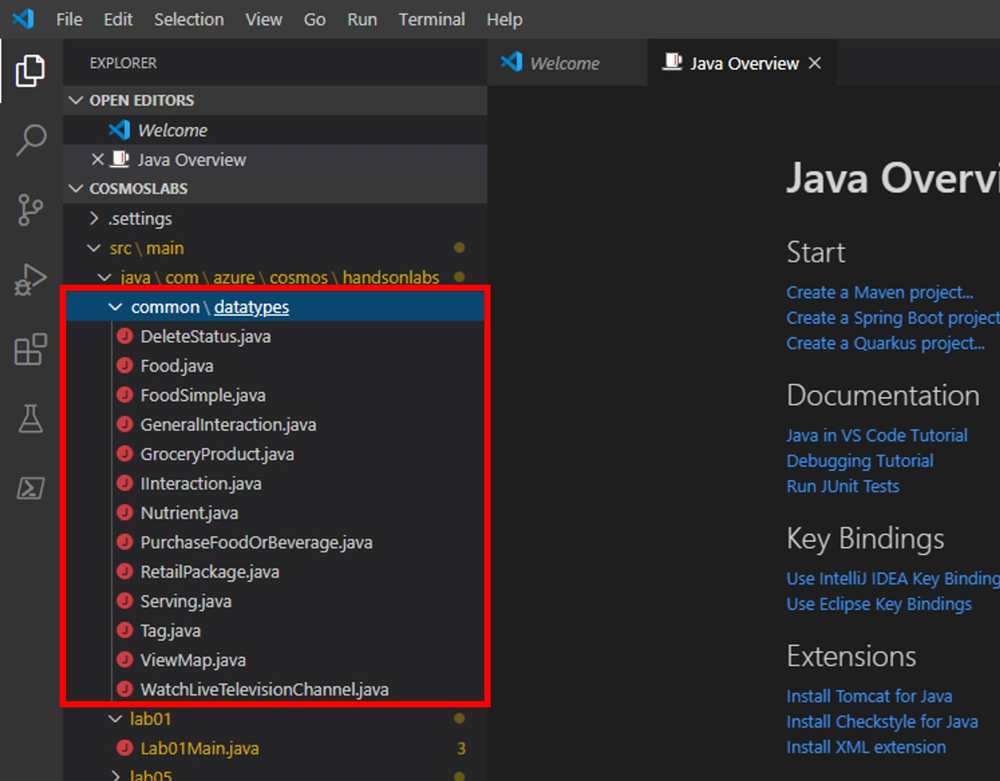
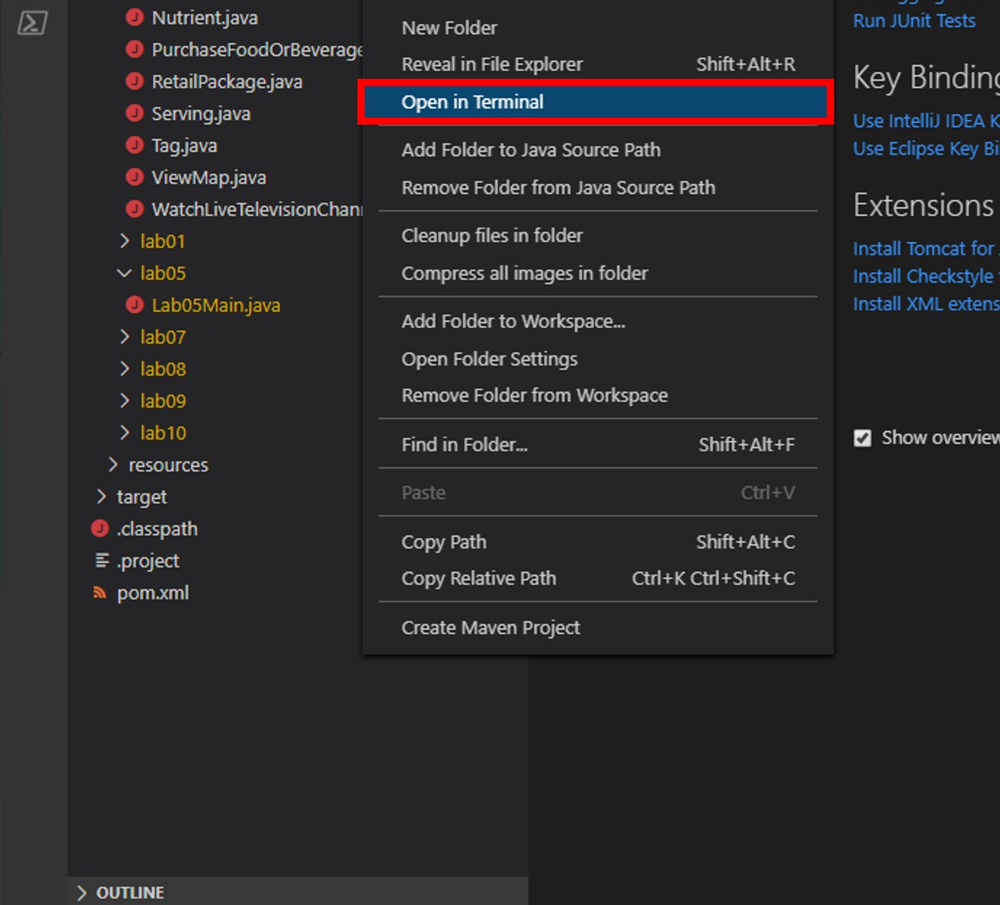
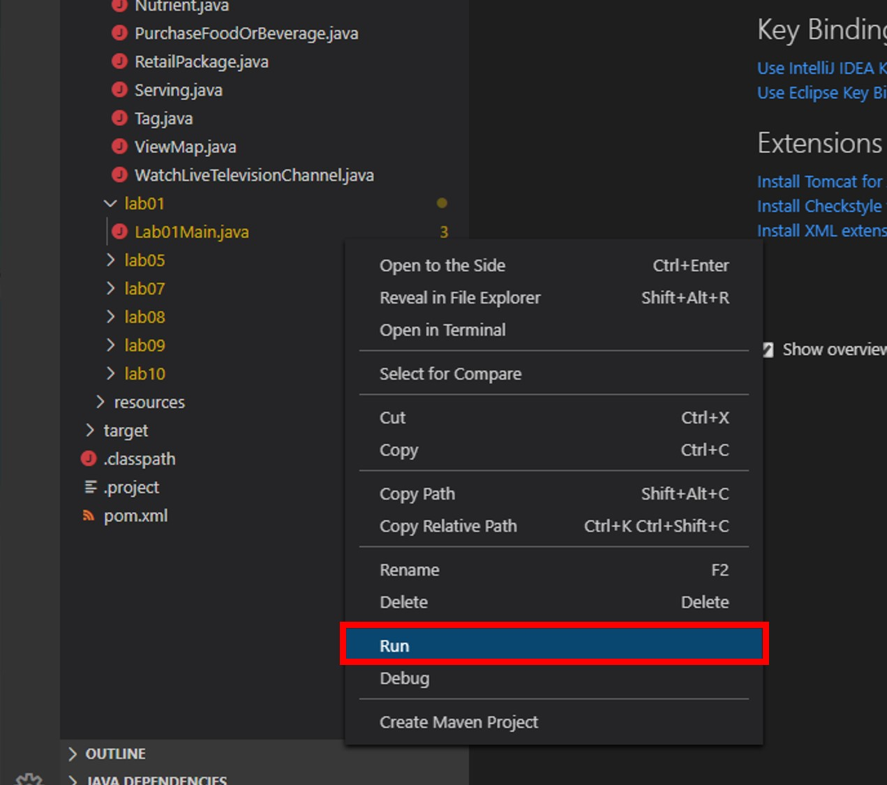

## Build A Simple Java Console App

_After using the Azure Portal's **Data Explorer** to query an Azure Cosmos DB container. You are now going to use the Java SDK to issue similar queries._

> If this is your first lab and you have not already completed the setup for the lab content see the instructions for [Account Setup](00-account_setup.md) before starting this lab.

## Open the CosmosLabs Maven Project Template

1. Open Visual Studio Code.

1. If you are completing this lab through Microsoft Hands-on Labs, the CosmosLabs folder will be located at the path: **your\home\directory\Documents\CosmosLabs**. In Visual Studio Code, go to **File > Open Folder >** to get an Open Folder dialog and and use the dialog to open the CosmosLabs folder. 

    

1. To see where Java source for the Labs is located, go to Visual Studio Code and click the **Explorer** pane. Expand the contents of the CosmosLabs folder in Visual Studio Code; expand down to **src\main\java\com\azure\cosmos\handsonlabs\\common\\datatypes\\** and double-check that you still have datatype Java files for use in the Labs.

    

1. Looking now two directories above, expand the **handsonlabs\\lab05\\** folder. This directory is where you will develop code for this Lab. You should see only a **Lab05Main.java** file - this is the **main** class for the project.

1. Open **Lab05Main.java** in the editor by clicking on it in the **Explorer** pane.

    

1. In the Visual Studio Code window, in the **Explorer** pane, right-click the empty space in pane and choose the **Open in Terminal** menu option.

    

1. Let's start by building the template code. In the open terminal pane, enter and execute the following command:

    ```sh
    mvn clean package
    ```

    > This command will build the console project.

1. Click the **🗙** symbol to close the terminal pane.

1. For the `endpointUri` variable, replace the placeholder value with the **URI** value and for the `primaryKey` variable, replace the placeholder value with the **PRIMARY KEY** value from your Azure Cosmos DB account. Use [these instructions](00-account_setup.md) to get these values if you do not already have them:

   > For example, if your **uri** is `https://cosmosacct.documents.azure.com:443/`, your new variable assignment will look like this: `private static String endpointUri = "https://cosmosacct.documents.azure.com:443/";`.

   > For example, if your **primary key** is `elzirrKCnXlacvh1CRAnQdYVbVLspmYHQyYrhx0PltHi8wn5lHVHFnd1Xm3ad5cn4TUcH4U0MSeHsVykkFPHpQ==`, your new variable assignment will look like this: `private static String primaryKey = "elzirrKCnXlacvh1CRAnQdYVbVLspmYHQyYrhx0PltHi8wn5lHVHFnd1Xm3ad5cn4TUcH4U0MSeHsVykkFPHpQ==";`.

   > We are now going to implement a sample query to make sure our client connection code works.

## Read a single Document in Azure Cosmos DB Using readItem()

_```readItem()``` allows a single item to be retrieved from Cosmos DB by its ID._ In Azure Cosmos DB, this is the most efficient method of reading a single document.

1. Locate the client-create/client-close block within the **main** method:

    ```java
    CosmosAsyncClient client = new CosmosClientBuilder()
            .setEndpoint(endpointUri)
            .setKey(primaryKey)
            .setConnectionPolicy(defaultPolicy)
            .setConsistencyLevel(ConsistencyLevel.EVENTUAL)
            .buildAsyncClient();

    targetDatabase = client.getDatabase("EntertainmentDatabase");
    customContainer = targetDatabase.getContainer("CustomCollection");            

    client.close();
    ```

1. Add the following lines of code to use the **readItem** function to retrieve a single item from your Cosmos DB by its `id` and write its description to the console.

    ```java
    container.readItem("19130", new PartitionKey("Sweets"), Food.class)
        .flatMap(candyResponse -> {
        Food candy = candyResponse.getItem();
        logger.info("Read {}",candy.getDescription());
        return Mono.empty();
    }).block();
    ```

1. Save all of your open editor tabs.

1. In the **Explorer** pane, right-click **Lab05Main.java** and choose the **Run** menu option.

    

    > This command will build and execute the console project.

1. Within the logger output to the terminal, you should see the following line output in the console, indicating that **readItem** completed successfully:

   ```sh
   Read Candies, HERSHEY''S POT OF GOLD Almond Bar
   ```

1. Click the **🗙** symbol to close the terminal pane.

## Execute a Query Against a Single Azure Cosmos DB Partition 

1.  Find the last line of code you wrote

    ```java
    }).block();
    ```

    and replace it with the following:

    ```java
    })
    .flux()
    .flatMap(voidItem -> {

    }).blockLast();
    ```

    ```flux()``` converts the ```Mono<Void>``` output of the previous stream operation to a ```Flux<Void>```. This is necessary because the query we perform in this section will return output as a ```Flux<FeedResponse<Food>>``` i.e. as a ```Flux``` of query response pages. This may be highlighted as an error by your IDE because the final reactive stream operation contains no return statement; we will fix this soon.

1.  Within the empty brackets you created

    ```java
    })
    .flux()
    .flatMap(voidItem -> {
        //<== Add new code here
    }).blockLast();
    ```

    define the following SQL Query string:

    ```java
    String sqlA = "SELECT f.description, f.manufacturerName, f.servings FROM foods f WHERE f.foodGroup = 'Sweets' and IS_DEFINED(f.description) and IS_DEFINED(f.manufacturerName) and IS_DEFINED(f.servings)";
    ```

    > In the following section we will run this query against the nutrition dataset. This query will select all food where the foodGroup is set to the value `Sweets`. It will also only select documents that have description, manufacturerName, and servings properties defined. You'll note that the syntax is very familiar if you've done work with SQL before. Also note that because this query has the partition key in the WHERE clause, this query can execute within a single partition.

1. Add the following code to execute the query and get back a ```Flux<FeedResponse<Food>>``` containing the query response pages:

    ```java
    FeedOptions optionsA = new FeedOptions();
    optionsA.setMaxDegreeOfParallelism(1);
    return container.queryItems(sqlA, optionsA, Food.class).byPage();
    ```
    
    Your code should now look like this:

    ```java
    })
    .flux()
    .flatMap(voidItem -> {

        String sqlA = "SELECT f.description, f.manufacturerName, " + 
        "f.servings FROM foods f WHERE f.foodGroup = " + 
        "'Sweets' and IS_DEFINED(f.description) and " + 
        "IS_DEFINED(f.manufacturerName) and IS_DEFINED(f.servings)";

        FeedOptions optionsA = new FeedOptions();
        optionsA.setMaxDegreeOfParallelism(1);
        return container.queryItems(sqlA, optionsA, Food.class).byPage();
    }).blockLast();
    ```    
1. We still need to process the query response pages. Add another empty reactive stream operation before ```.blockLast()``` as shown:

    ```java
            })
            .flux()
            .flatMap(voidItem -> {

                String sqlA = "SELECT f.description, f.manufacturerName, " + 
                "f.servings FROM foods f WHERE f.foodGroup = " + 
                "'Sweets' and IS_DEFINED(f.description) and " + 
                "IS_DEFINED(f.manufacturerName) and IS_DEFINED(f.servings)";

                FeedOptions optionsA = new FeedOptions();
                optionsA.setMaxDegreeOfParallelism(1);
                return container.queryItems(sqlA, optionsA, Food.class).byPage();
            }).flatMap(page -> {

                return Mono.empty();
    }).blockLast();
    ```

    Since we already added ```return Mono.empty()```, your IDE should not flag this code as errant.

1. Within the empty reactive stream operation that you just created

    ```java
            }).flatMap(page -> {

                return Mono.empty();
    }).blockLast();
    ```

    and before the ```return``` statement, add the following code which prints out the query responses in each page:

    ```java
    for (Food fd : page.getResults()) {
        String msg="";
        msg = String.format("%s by %s\n",fd.getDescription(),fd.getManufacturerName());

        for (Serving sv : fd.getServings()) {
            msg += String.format("\t%f %s\n",sv.getAmount(),sv.getDescription());
        }
        msg += "\n";
        logger.info(msg);
    } 
    ```

1. Save all of your open editor tabs.

1. In the **Explorer** pane, right-click **Lab05Main.java** and choose the **Run** menu option.

1.  The code will loop through each result of the SQL query. Within the logger output in the terminal, you should see a message similar to the following:

    ```sh
    ...

    Puddings, coconut cream, dry mix, instant by
        1 package (3.5 oz)
        1 portion, amount to make 1/2 cup

    ...
    ```

1. Click the **🗙** symbol to close the terminal pane.

### Execute a Query Against Multiple Azure Cosmos DB Partitions

1. In this section we will run another query. Extend the reactive stream by duplicating your query code as shown below:

    ```java
                 .flatMap(voidItem -> {

                    String sqlA = "SELECT f.description, f.manufacturerName, " + 
                                  "f.servings FROM foods f WHERE f.foodGroup = " + 
                                  "'Sweets' and IS_DEFINED(f.description) and " + 
                                  "IS_DEFINED(f.manufacturerName) and IS_DEFINED(f.servings)";

                    FeedOptions optionsA = new FeedOptions();
                    optionsA.setMaxDegreeOfParallelism(1);
                    return container.queryItems(sqlA, optionsA, Food.class).byPage();
                 }).flatMap(page -> {
                    for (Food fd : page.getResults()) {
                        String msg="";
                        msg = String.format("%s by %s\n",fd.getDescription(),fd.getManufacturerName());

                        for (Serving sv : fd.getServings()) {
                            msg += String.format("\t%f %s\n",sv.getAmount(),sv.getDescription());
                        }
                        msg += "\n";
                        logger.info(msg);
                    }

                    return Mono.empty();
                 }).flatMap(voidItem -> { //<== Duplicate starts here

                    String sqlA = "SELECT f.description, f.manufacturerName, " + 
                                  "f.servings FROM foods f WHERE f.foodGroup = " + 
                                  "'Sweets' and IS_DEFINED(f.description) and " + 
                                  "IS_DEFINED(f.manufacturerName) and IS_DEFINED(f.servings)";

                    FeedOptions optionsA = new FeedOptions();
                    optionsA.setMaxDegreeOfParallelism(1);
                    return container.queryItems(sqlA, optionsA, Food.class).byPage();
                 }).flatMap(page -> {
                    for (Food fd : page.getResults()) {
                        String msg="";
                        msg = String.format("%s by %s\n",fd.getDescription(),fd.getManufacturerName());

                        for (Serving sv : fd.getServings()) {
                            msg += String.format("\t%f %s\n",sv.getAmount(),sv.getDescription());
                        }
                        msg += "\n";
                        logger.info(msg);
                    }

                    return Mono.empty();
        }).blockLast();
    ```

1. **Within the duplicate query code** find where you define ```String sqlA``` and replace it with a new query ```String sqlB``` as shown below:

    ```java
    string sqlB = "SELECT f.id, f.description, f.manufacturerName, f.servings FROM foods f WHERE IS_DEFINED(f.manufacturerName)";
    ```

    because ```sqlA``` is no longer defined, your IDE may flag an error until you make the following changes.

1. For this query, we will run with greater concurrency and allow a max item count of 100. Find this section of the duplicate query code

    ```java
    FeedOptions optionsA = new FeedOptions();
    optionsA.setMaxDegreeOfParallelism(1);
    return container.queryItems(sqlA, optionsA, Food.class).byPage();
    ```

    and replace it with

    ```java
    FeedOptions optionsB = new FeedOptions();
    optionsB.setMaxDegreeOfParallelism(5);
    optionsB.setMaxItemCount(100);
    return container.queryItems(sqlB, optionsB, Food.class).byPage();
    ```

    > Take note of the differences in this call to **queryItems** as compared to the previous section. **maxDegreeOfParallelism** is set to `5` and we are limiting the **maxItemCount** to `100` items. This will result in paging if there are more than 100 items that match the query.

1. Now we will look at handling the paged response to this query. First, find the variable declarations at the top of the **Lab05Main** class definition and add another one:

    ```java
    private static AtomicInteger pageCount = new AtomicInteger(0);
    ```

    which creates a thread-safe page count variable initialized to zero.

1. In the duplicate query code find the portion which pages through the query response

    ```java
    String msg="";

    msg = String.format("---Page %d---\n",pageCount.getAndIncrement());

    for (Food fd : page.getResults()) {
        msg += String.format("\t%s\t%s\t%s\n",fd.getId(),fd.getDescription(),fd.getManufacturerName());
    }
    logger.info(msg); 
    ```

    and modify it to read as follows:

    ```java
    String msg="";

    msg = String.format("---Page %d---\n",pageCount.getAndIncrement());

    for (Food fd : page.getResults()) {
        msg += String.format("\t[%s]\t%s\t%s\n",fd.getId(),fd.getDescription(),fd.getManufacturerName());
    }
    logger.info(msg);    
    ```

1. Save all of your open editor tabs.

1. In the **Explorer** pane, right-click **Lab05Main.java** and choose the **Run** menu option.

1.  Within the logger output, you should see a number of new results, each separated by the a line indicating the page, as follows:

    ```
        ---Page #0016---
        [19065] Candies,ALMOND JOY Candy Bar   Hershey Food Corp.
        [19067] Candies, TWIZZLERS CHERRY BITES Hershey Food Corp.        
    ```

> Note that the results are coming from multiple partitions.

1. Click the **🗙** symbol to close the terminal pane.

> If this is your final lab, follow the steps in [Removing Lab Assets](11-cleaning_up.md) to remove all lab resources. 