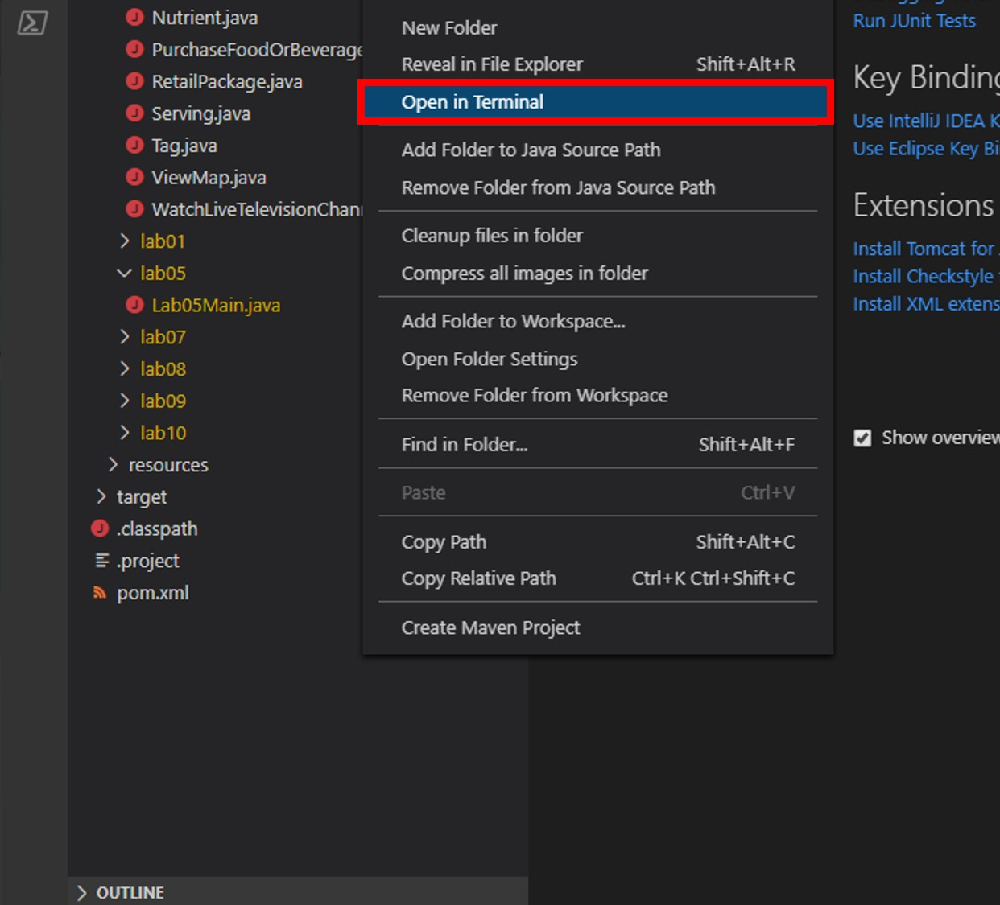

# Azure Cosmos DB Change Feed

In this lab you will use the Change Feed Processor Library and Azure Functions to implement three use cases for the Azure Cosmos DB Change Feed

> If this is your first lab and you have not already completed the setup for the lab content see the instructions for [Account Setup](00-account_setup.md) before starting this lab.

## Build a Data Generator app to Generate Data

In order to simulate data flowing into our store, in the form of actions on an e-commerce website, we'll create a simple Java class to generate and add documents to our Cosmos DB CartContainer

1. On your local machine, locate the CosmosLabs folder in your Documents folder and open the `Lab08` folder that will be used to contain the content of your java project. If you are completing this lab through Microsoft Hands-on Labs, the CosmosLabs folder will be located at the path: **C:\labs\CosmosLabs**

1. Open Visual Studio Code.

1. If you are completing this lab through Microsoft Hands-on Labs, the CosmosLabs folder will be located at the path: **your\home\directory\Documents\CosmosLabs**. In Visual Studio Code, go to **File > Open Folder >** to get an Open Folder dialog and and use the dialog to open the CosmosLabs folder.

    

1. Expand the directory tree to **src\main\java\com\azure\cosmos\handsonlabs\lab08\\DataGenerator\** folder. This directory is where you will develop code for this Lab. You should see only a **DataGenerator.java** file - this is the ``main`` class for this task.

1. Open **DataGenerator.java** in the editor by clicking on it in the **Explorer** pane.

1. In the Visual Studio Code window, in the **Explorer** pane, right-click the empty space in pane and choose the **Open in Terminal** menu option.

    

1. Let's start by building the template code. In the open terminal pane, enter and execute the following command:

    ```sh
    mvn clean package
    ```

    > This command will build the console project.

1. Click the **🗙** symbol to close the terminal pane.

1. For the `endpointUri` variable, replace the placeholder value with the **URI** value and for the `primaryKey` variable, replace the placeholder value with the **PRIMARY KEY** value from your Azure Cosmos DB account. Use [these instructions](00-account_setup.md) to get these values if you do not already have them:

   > For example, if your **uri** is `https://cosmosacct.documents.azure.com:443/`, your new variable assignment will look like this: `private static String endpointUri = "https://cosmosacct.documents.azure.com:443/";`.

   > For example, if your **primary key** is `elzirrKCnXlacvh1CRAnQdYVbVLspmYHQyYrhx0PltHi8wn5lHVHFnd1Xm3ad5cn4TUcH4U0MSeHsVykkFPHpQ==`, your new variable assignment will look like this: `private static String primaryKey = "elzirrKCnXlacvh1CRAnQdYVbVLspmYHQyYrhx0PltHi8wn5lHVHFnd1Xm3ad5cn4TUcH4U0MSeHsVykkFPHpQ==";`.

   > We are now going to implement a sample query to make sure our client connection code works.

### Create Function to Add Documents to Cosmos DB

The key functionality of this application is to add documents to our Cosmos DB to simulate activity on our e-commerce website. Here, you'll create a data definition for these documents and define a function to add them.

1. Within the `DataGenerator.java` file in the **Lab08** folder, locate the `main()` method. The purpose of this method is to add an instance of **CartAction** to our CosmosDB Container.

   > If you'd like to review how to add documents to a CosmosDB container, [refer to Lab 01](01-creating_partitioned_collection.md).

### Create a Function to Generate Random Shopping Data

1. Within the `DataGenerator.java` file in the **DataGenerator** folder, locate the `generateActions()` method. The purpose of this method is to create randomized **CartAction** objects that you'll consume using the CosmosDB change feed.

    ```java
    private static List<CartAction> generateActions() {

        List<CartAction> actions = new ArrayList<CartAction>();

        int itemIndex = random.nextInt(items.length);
        int stateIndex = random.nextInt(states.length);
        int cartId = (random.nextInt(99999 - 1000) + 1000);
        ActionType actionType = ActionType.values()[random.nextInt(ActionType.values().length)];
        CartAction cartAction = new CartAction(cartId, actionType, items[itemIndex], prices[itemIndex],
                states[stateIndex]);

        if (cartAction.action != ActionType.Viewed) {
            List<ActionType> previousActions = new ArrayList<ActionType>();
            previousActions.add(ActionType.Viewed);

            if (cartAction.action == ActionType.Purchased) {
                previousActions.add(ActionType.Added);
            }

            previousActions.forEach(previousAction -> {
                CartAction previous = new CartAction(cartAction.cartId, previousAction, cartAction.item,
                        cartAction.price, cartAction.buyerState);
                actions.add(previous);
            });
        }

        actions.add(cartAction);
        return actions;
    }
    ```

1. Your ``main`` method should now look like this:

   ```java
    public static void main(String[] args) {

        CosmosAsyncClient client = new CosmosClientBuilder()
                .endpoint(endpointUri)
                .key(primaryKey)
                .consistencyLevel(ConsistencyLevel.EVENTUAL)
                .contentResponseOnWriteEnabled(true)
                .buildAsyncClient();

        storeDatabase = client.getDatabase("StoreDatabase");
        cartContainer = storeDatabase.getContainer("CartContainer");

        logger.info("Enter number of documents to generate.");
        
        Scanner scanner = new Scanner(System.in);
        int noOfDocuments = scanner.nextInt();
        scanner.close();

        List<CartAction> cartActions = new ArrayList<CartAction>();
        for (int i = 0; i < noOfDocuments; i++) {
            cartActions.addAll(generateActions());
        }

        Flux<CartAction> cartActionFlux = Flux.fromIterable(cartActions);

        cartActionFlux.flatMap(item -> {
            return cartContainer.createItem(item);
        }).collectList().block();

        client.close();
    }
    ```

1. Save all of your open editor tabs.

1. In the **Explorer** pane, right-click **DataGenerator.java** and choose the **Run** menu option. You will see the following message in the console.
    > Enter number of documents to generate.

1. Switch to the Azure Portal and your Cosmos DB Account.

1. From within the **Azure Cosmos DB** blade, select the **Data Explorer** tab on the left.

   

1. Expand the **StoreDatabase** then the **CartContainer** and select **Scale and Settings**. Enter the throughput manually according to the number of documents you want to generate. You might need to tune this settings based on your environment.
    

1. Switch to DataGenerator console app and enter the number of documents to generate in the console and press enter.

### Verify Functionality of the application

In this step you'll take a look at your Cosmos DB account to ensure test data is being written as expected.

1. Switch to the Azure Portal and your Cosmos DB Account.

2. From within the **Azure Cosmos DB** blade, select the **Data Explorer** tab on the left.

3. Expand the **StoreDatabase** then the **CartContainer** and select **Items**. You should see something like the following screenshot.

   > Note your data will be slightly different since it is random, the important thing is that there is data here at all

   

## Consume Cosmos DB Change Feed via the Change Feed Processor

The two main options for consuming the Cosmos DB change feed are Azure Functions and the Change Feed Processor library. We'll start with the Change Feed Processor via a simple console application

### Connect to the Cosmos DB Change Feed

The first use case we'll explore for Cosmos DB Change Feed is Live Migration. A common concern when designing a Cosmos DB container is proper selection of a partition key. You'll recall that we created our `CartContainer` with a partition key of `/Item`. What if we find out later this key is wrong? Or what if writes work better with `/Item` while reads work better with `/BuyerState` as the partition key? We can avoid analysis paralysis by using Cosmos DB Change Feed to migrate our data in real time to a second container with a different partition key!

1. Switch back to Visual Studio Code

2. Select the `ChangeFeedMain.java` in the **Explorer** pane to open the file in the editor.

3. For the `endpointUri` variable, replace the placeholder value with the **URI** value and for the `primaryKey` variable, replace the placeholder value with the **PRIMARY KEY** value from your Azure Cosmos DB account.

4. In this case we are going to migrate our data to another container (CartContainerByState) within the same database. The same ideas apply even if we wanted to migrate our data to another database entirely.

5. In order to consume the change feed we make use of a **Lease Container**. Add the following lines of code to create the lease container:

   ```java
   storeDatabase
         .createContainerIfNotExists("consoleLeases", "/id", ThroughputProperties.createManualThroughput(400))
         .flatMap(containerResponse -> {
                  leaseContainer = storeDatabase.getContainer(containerResponse.getProperties().getId());
                  return Mono.empty();
          }).subscribe();
   ```

   > The **Lease Container** stores information to allow for parallel processing of the change feed, and acts as a book mark for where we last processed changes from the feed.

6. Now, add the following lines of code directly after the **leaseContainer** definition in order to get an instance of the change processor:

   ```java
    ChangeFeedProcessor processor = new ChangeFeedProcessorBuilder()
                .hostName("host_1")
                .feedContainer(cartContainer)
                .leaseContainer(leaseContainer)
                .handleChanges(
                        docs -> {
                            //todo: Add processor code here
                        })
                .buildChangeFeedProcessor();
  
   ```

   > Each time a set of changes is received, the code inside ``handleChanges`` will be called. We're skipping the handling of those changes for the moment.

7. In order for our processor to run, we have to start it. Following the definition of **processor** add the following line of code:

   ```java
   processor.start().subscribe();
   ```

8. Finally, when a key is pressed to terminate the processor we need to end it. Locate the `//todo: Add stop code here` line and replace it with this code:

   ```java
   processor.stop().subscribe();
   ```

9. At this point, your `ChangeFeedMain.java` file should look like this:

   ```java
    import com.azure.cosmos.ChangeFeedProcessor;
    import com.azure.cosmos.ChangeFeedProcessorBuilder;
    import com.azure.cosmos.ConsistencyLevel;
    import com.azure.cosmos.CosmosAsyncClient;
    import com.azure.cosmos.CosmosAsyncContainer;
    import com.azure.cosmos.CosmosAsyncDatabase;
    import com.azure.cosmos.CosmosClientBuilder;
    import com.azure.cosmos.models.ThroughputProperties;
    
    import java.util.Scanner;
    
    import org.slf4j.Logger;
    import org.slf4j.LoggerFactory;
    
    import reactor.core.publisher.Flux;
    import reactor.core.publisher.Mono;
    
    public class ChangeFeedMain {
    
        protected static Logger logger = LoggerFactory.getLogger(ChangeFeedMain.class.getSimpleName());
        private static final String endpointUri = "https://cosmoslab49436.documents.azure.com:443/";
        private static final String primaryKey = "vyc7qlrLcBrIhAqc83ffehiOLuhw3kCUBKqjdfhJJvZbg1wSXYJaCx2a9yNhdEqNosMHQG8o02jQoulv169V3A==";
        private static CosmosAsyncDatabase storeDatabase;
        private static CosmosAsyncContainer cartContainer;
        private static CosmosAsyncContainer destinationContainer;
        private static CosmosAsyncContainer leaseContainer;
    
        public static void main(String[] args) {
            CosmosAsyncClient client = new CosmosClientBuilder()
                    .endpoint(endpointUri)
                    .key(primaryKey)
                    .consistencyLevel(ConsistencyLevel.EVENTUAL)
                    .contentResponseOnWriteEnabled(true)
                    .buildAsyncClient();
    
            storeDatabase = client.getDatabase("StoreDatabase");
            cartContainer = storeDatabase.getContainer("CartContainer");
            destinationContainer = storeDatabase.getContainer("CartContainerByState");
            storeDatabase
                    .createContainerIfNotExists("consoleLeases", "/id", ThroughputProperties.createManualThroughput(400))
                    .flatMap(containerResponse -> {
                        leaseContainer = storeDatabase.getContainer(containerResponse.getProperties().getId());
                        return Mono.empty();
                    }).subscribe();
    
            ChangeFeedProcessor processor = new ChangeFeedProcessorBuilder()
                    .hostName("host_1")
                    .feedContainer(cartContainer)
                    .leaseContainer(leaseContainer)
                    .handleChanges(
                            docs -> {
                                //todo: Add processor code here
                            })
                    .buildChangeFeedProcessor();
    
            processor.start().subscribe();
    
            logger.info("Started Change Feed Processor");
            logger.info("Press any key to stop the processor...");
    
            Scanner input = new Scanner(System.in);
            input.next();
            input.close();
    
            logger.info("Stopping Change Feed Processor");
    
            processor.stop().subscribe();
        }
    }
   ```

### Complete the Live Data Migration

1. Within the `ChangeFeedMain.java` file , locate the todo we left ourselves `//todo: Add processor code here` and replace with following lines of code.

   ```java
   logger.info("Changes received: " + docs.size());
   Flux.fromIterable(docs).flatMap(doc -> destinationContainer.createItem(doc))
      .flatMap(itemResponse -> Mono.empty()).subscribe();
   ```

    >The **docs** is a collection of **CartAction** documents that have changed. To migrate them, we'll simply loop through them and write them out to our destination container.

### Test to Confirm the Change Feed Function Works

Now that we have our first Change Feed consumer, we're ready to run a test and confirm that it works

1. Save all of your open editor tabs.

1. Right-click and run the project as you did previously.

1. Once the function starts running you'll see the following messages in your console:

   ```sh
   Started Change Feed Processor
   Press any key to stop the processor...
   ```

   > Because this is the first we've run this consumer, there will be no data to consume. We'll start the data generator in order to start receiving changes.

1. In the **first** terminal window, navigate to the **DataGenerator** class

1. Right-click and run the DataGenerator app. You will see a message in the console.
    > Enter number of documents to generate.

1. Switch to the Azure Portal and your Cosmos DB Account.

1. From within the **Azure Cosmos DB** blade, select the **Data Explorer** tab on the left.

1. Expand the **StoreDatabase** then the **CartContainer** and select **Scale and Settings**. Enter the throughput manually according to the number of documents you want to generate. You might need to tune this settings based on your environment.
    

1. Switch to DataGenerator console app and enter the number of documents to generate in the console and press enter.

1. Soon after data starts being written, you'll start to see the following output in the **second** terminal window:

   ```sh
   100 Changes Received
   100 Changes Received
   3 Changes Received
   ...
   ```

1. After a few minutes, navigate to the **cosmosdblab** Data Explorer and expand **StoreDatabase** then **CartContainerByState** and select **Items**. You should see items populating there, and note that the Partition Key this time is `/BuyerState`.

   

1. Let the **ChangeFeedMain** finish running (it shouldn't take very long). You'll know it's done when it stops writing new log messages. Stop the function by pressing any key in the **second** terminal window.

> You've now written your first Cosmos DB Change Feed consumer, which writes live data to a new collection. Congrats! In the next steps we'll take a look at using Azure Functions to consume Cosmos DB change feed for two additional use cases.

## Create an Azure Function to Consume Cosmos DB Change Feed

One of the interesting features of Azure Cosmos DB is its change feed. The change feed provides support for many scenarios, three of which we'll investigate further in this lab.

### Create a Java Azure Functions Project

Azure Functions provide a quick and easy way to hook up with the Cosmos DB Change Feed in a way that is scalable out of the box. You'll start by setting up Java Azure Functions maven project.

#### Configure your local environment

Before you begin, you must have the following:

1. The [Azure Functions Core Tools](https://docs.microsoft.com/en-us/azure/azure-functions/functions-run-local#v2) version 4.x.

2. The [Azure CLI](https://docs.microsoft.com/en-us/cli/azure/install-azure-cli) version 2.4 or later.

#### Prerequisite check

1. In a terminal or command window, run ```func --version``` to check that the Azure Functions Core Tools are version 4.x.

2. Run ```az --version``` to check that the Azure CLI version is 2.4 or later.

3. Run ```az login``` to sign in to Azure and verify an active subscription.

#### Create a local functions project

1. Open the **Lab08** folder and go to the ```MaterializedViewFunction.java``` class and replace entire code with following lines.

    ```java
    import com.microsoft.azure.functions.annotation.*;
    import com.microsoft.azure.functions.*;
    
    /**
     * Azure Functions in Java with Cosmos DB Trigger.
     */
    public class MaterializedViewFunction {
    
        @FunctionName("MaterializedViewFunction")
        public void cosmosDbProcessor(
                @CosmosDBTrigger(name = "items",
                databaseName = "database", collectionName = "collection1",
                createLeaseCollectionIfNotExists = true,
                connectionStringSetting = "AzureCosmosDBConnection") String[] items,
                final ExecutionContext context) {
                    //todo: add code here
            context.getLogger().info(items.length + "item(s) is/are changed.");
        }
    }
    
    ```

2. Locate ```local.settings.json``` file inside the maven project and replace it with following lines.

    ```json
    {
      "IsEncrypted": false,
      "Values": {
        "AzureWebJobsStorage": "UseDevelopmentStorage=true",
        "AzureCosmosDBConnection": "<PRIMARY CONNECTION STRING for Cosmos DB from Azure Portal>",
        "FUNCTIONS_WORKER_RUNTIME": "java"
      }
    }
    ```

3. Open a terminal window and run this command.

    ```sh
        mvn clean package
    ```

    > This command will build the project.

## Use Cosmos DB Change Feed for the Materialized View Pattern

The Materialized View pattern is used to generate pre-populated views of data in environments where the source data format is not well suited to the applications requirements. In this example, we'll create a real time collection of sales data aggregated by State that would allow another application to quickly retrieve summary sales data

### Create the Materialized View Azure Function

1. Select the new `MaterializedViewFunction.java` file to open it in the editor.

   > The **databaseName**, **collectionName** and **ConnectionStringSetting** refer to the source Cosmos DB account that the function is listening for changes on.

1. Change the **databaseName** value to `StoreDatabase`

1. Change the **collectionName** value to `CartContainerByState`

   > Cosmos DB Change Feeds are guaranteed to be in order within a partition, so in this case we want to use the Container where the partition is already set to the State, `CartContainerByState`, as our source

1. Replace the **ConnectionStringSetting** placeholder with the new setting you added earlier **DBConnection**

   ```java
   ConnectionStringSetting = "AzureCosmosDBConnection",
   ```

1. Between **ConnectionStringSetting** and **LeaseCollectionName** add the following line:

   ```java
   CreateLeaseCollectionIfNotExists = true,
   ```

1. Change the **LeaseCollectionName** value to `materializedViewLeases`

   > Lease collections are a critical part of the Cosmos DB Change Feed. They allow multiple instances of a function to operate over a collection and serve as a virtual *bookmark* for where the function last left off.

1. Your **CosmosDBProcessor** function should now look like this:

   ```java
   @FunctionName("MaterializedViewFunction")
    public void cosmosDbProcessor(
            @CosmosDBTrigger(name = "MaterializedView", databaseName = "StoreDatabase", collectionName = "CartContainerByState", createLeaseCollectionIfNotExists = true, leaseCollectionName = "materializedViewLeases", connectionStringSetting = "AzureCosmosDBConnection") String[] items,
            final ExecutionContext context) {
        
        if (items != null && items.length > 0){
          logger.info("Documents modified " + items.length);
          logger.info("First document Id " + items[0].id);
       }

    }
   ```

> The function works by polling your container on an interval and checking for changes since the last lease time. Each turn of the function may result in multiple documents that have changed, which is why the input is an String array of Documents.

1. Add the following using statements to the top of the `MaterializedViewFunction.cs` file:

   ```java
    import com.azure.cosmos.ConsistencyLevel;

    import com.azure.cosmos.CosmosAsyncClient;
    import com.azure.cosmos.CosmosAsyncContainer;
    import com.azure.cosmos.CosmosAsyncDatabase;
    import com.azure.cosmos.CosmosClientBuilder;
    import com.azure.cosmos.handsonlabs.common.datatypes.ActionType;
    import com.azure.cosmos.handsonlabs.common.datatypes.CartAction;
    import com.azure.cosmos.handsonlabs.common.datatypes.StateCount;
    import com.azure.cosmos.models.CosmosQueryRequestOptions;
    import com.fasterxml.jackson.core.JsonProcessingException;
    import com.fasterxml.jackson.databind.JsonMappingException;
    import com.fasterxml.jackson.databind.ObjectMapper;
    import com.microsoft.azure.functions.ExecutionContext;
    import com.microsoft.azure.functions.annotation.CosmosDBTrigger;
    import com.microsoft.azure.functions.annotation.FunctionName;
    
    import reactor.core.publisher.Flux;
    import reactor.core.publisher.Mono;
    
    import java.util.ArrayList;
    import java.util.HashMap;
    import java.util.List;
    import java.util.Map;
    
   ```

1. Your target this time is the container called **StateSales**. Add the following lines to the top of the **MaterializedViewFunction** to setup the destination connection. Be sure to replace the endpoint url and the key.

   ```csharp
    private String endpointUri = "<your-endpoint-url>";
    private String primaryKey = "<your-primary-key>";
    private String databaseId = "StoreDatabase";
    private String containerId = "StateSales";
    private CosmosAsyncClient client;

    public MaterializedViewFunction() {
        client = new CosmosClientBuilder()
                .endpoint(endpointUri)
                .key(primaryKey)
                .consistencyLevel(ConsistencyLevel.EVENTUAL)
                .contentResponseOnWriteEnabled(true)
                .buildAsyncClient();
    }
   ```

### Update the MaterializedViewFunction to Create the Materialized View

The Azure Function receives a list of Documents that have changed. We want to organize this list into a map keyed off of the state of each document and keep track of the total price and count of items purchased. We'll use this map later to write data to our materialized view collection **StateSales**

1. Locate the following section in the code for **MaterializedViewFunction.cs**

   ```java
   if (items != null && items.length > 0) {
        logger.info("Documents modified " + items.length);
        logger.info("First document Id " + items[0].id);
   }
   ```

1. Replace the two logging lines with the following code:

   ```java
       Map<String, List<Double>> stateMap = new HashMap<String, List<Double>>();
       ObjectMapper objectMapper = new ObjectMapper();

        for (String doc : items) {
            try {
                CartAction cartAction = objectMapper.readValue(doc, CartAction.class);
                if (cartAction.action != ActionType.Purchased) {
                    continue;
                }
                if (!stateMap.containsKey(cartAction.buyerState)) {
                    stateMap.put(cartAction.buyerState, new ArrayList<Double>());
                }
                stateMap.get(cartAction.buyerState).add(cartAction.price);
            } catch (JsonMappingException e) {
                e.printStackTrace();
            } catch (JsonProcessingException e) {
                e.printStackTrace();
            }
        }
   ```

1. Following the conclusion of this *for* loop, add this code to connect to our destination container:

   ```java
     CosmosAsyncDatabase database = client.getDatabase(databaseId);
     CosmosAsyncContainer container = database.getContainer(containerId);

      //todo - Next steps go here
   ```

1. Because we're dealing with an aggregate collection, we'll be either creating or updating a document for each entry in our dictionary. For starters, we need to check to see if the document we care about exists. Add the following code after the `todo` line above:

   ```java
       Flux.fromIterable(stateMap.keySet())
                .flatMap(key -> {
                    String query = "select * from StateSales s where s.State ='" + key + "'";
                    return container.queryItems(query, new CosmosQueryRequestOptions(), StateCount.class)
                            .byPage(1)
                            .flatMap(page -> {
                                if (!page.getResults().isEmpty()) {
                                      //todo: Add existing doc code here
                                } else {
                                      //todo: Add new doc code here
                                }
                            }).flatMap(item -> {
                                //todo: Upsert document
                            });
                }).collectList().block();
   ```

   > Take note of the *maxItemCount* in the **byPage()** call. We're only expecting a single result at most because each state has at most one document.

1. In the case that the stateCount object is *null* we'll create a new one. Replace the `//todo: Add new doc code here` section with the following code:

   ```java
        StateCount stateCount = new StateCount();
        stateCount.state = key;
        stateCount.totalSales = stateMap.get(key).stream().reduce(0.0, (a, b) -> a + b);
        stateCount.count = stateMap.get(key).size();
        return Mono.just(stateCount);
   ```

1. In the case that the stateCount object exists, we'll update it. Replace the `//todo: Add existing doc code here` section with the following code:

   ```java
        StateCount stateCount = page.getResults().get(0);
        logger.info("found item with state: " + stateCount.getState());
        stateCount.totalSales += stateMap.get(key).stream().reduce(0.0, (a, b) -> a + b);
        stateCount.count += stateMap.get(key).size();
        return Mono.just(stateCount);
   ```

1. Finally, we'll do an *upsert* (Update or Insert) operation on our destination Cosmos DB account. Replace the `//todo: Upsert document` section with the following code:

   ```java
       logger.info("upsert item with state: " + item.getState());
       return container.upsertItem(item);
   ```

1. Your **MaterializedViewFunction** should now look like this:

   ```java
    import com.azure.cosmos.ConsistencyLevel;
    import com.azure.cosmos.CosmosAsyncClient;
    import com.azure.cosmos.CosmosAsyncContainer;
    import com.azure.cosmos.CosmosAsyncDatabase;
    import com.azure.cosmos.CosmosClientBuilder;
    import com.azure.cosmos.handsonlabs.common.datatypes.ActionType;
    import com.azure.cosmos.handsonlabs.common.datatypes.CartAction;
    import com.azure.cosmos.handsonlabs.common.datatypes.StateCount;
    import com.azure.cosmos.models.CosmosQueryRequestOptions;
    import com.fasterxml.jackson.core.JsonProcessingException;
    import com.fasterxml.jackson.databind.JsonMappingException;
    import com.fasterxml.jackson.databind.ObjectMapper;
    import com.microsoft.azure.functions.ExecutionContext;
    import com.microsoft.azure.functions.annotation.CosmosDBTrigger;
    import com.microsoft.azure.functions.annotation.FunctionName;
    
    import reactor.core.publisher.Flux;
    import reactor.core.publisher.Mono;
    
    import java.util.ArrayList;
    import java.util.HashMap;
    import java.util.List;
    import java.util.Map;
    
    import org.slf4j.Logger;
    import org.slf4j.LoggerFactory;
    
    /**
     * Azure Functions with HTTP Trigger.
     */
    public class MaterializedViewFunction {
    
        private String endpointUri = "<your-endpoint-url>";
        private String primaryKey =  "<primary-key>";
        private String databaseId = "StoreDatabase";
        private String containerId = "StateSales";
        protected static Logger logger = LoggerFactory.getLogger(Lab08Main.class.getSimpleName());
        private CosmosAsyncClient client;
    
        public MaterializedViewFunction() {
            client = new CosmosClientBuilder()
                    .endpoint(endpointUri)
                    .key(primaryKey)
                    .consistencyLevel(ConsistencyLevel.EVENTUAL)
                    .contentResponseOnWriteEnabled(true)
                    .buildAsyncClient();
        }
    
        @FunctionName("MaterializedViewFunction")
        public void cosmosDbProcessor(
                @CosmosDBTrigger(name = "MaterializedView", databaseName = "StoreDatabase", collectionName = "CartContainerByState", createLeaseCollectionIfNotExists = true, leaseCollectionName = "materializedViewLeases", connectionStringSetting = "AzureCosmosDBConnection") String[] items,
                final ExecutionContext context) {
    
            Map<String, List<Double>> stateMap = new HashMap<String, List<Double>>();
            ObjectMapper objectMapper = new ObjectMapper();
    
            for (String doc : items) {
                try {
                    CartAction cartAction = objectMapper.readValue(doc, CartAction.class);
                    if (cartAction.action != ActionType.Purchased) {
                        continue;
                    }
                    if (!stateMap.containsKey(cartAction.buyerState)) {
                        stateMap.put(cartAction.buyerState, new ArrayList<Double>());
                    }
                    stateMap.get(cartAction.buyerState).add(cartAction.price);
                } catch (JsonMappingException e) {
                    e.printStackTrace();
                } catch (JsonProcessingException e) {
                    e.printStackTrace();
                }
            }
    
            CosmosAsyncDatabase database = client.getDatabase(databaseId);
            CosmosAsyncContainer container = database.getContainer(containerId);
    
            Flux.fromIterable(stateMap.keySet())
                    .flatMap(key -> {
                        String query = "select * from StateSales s where s.State ='" + key + "'";
                        return container.queryItems(query, new CosmosQueryRequestOptions(), StateCount.class)
                                .byPage(1)
                                .flatMap(page -> {
                                    if (!page.getResults().isEmpty()) {
                                        StateCount stateCount = page.getResults().get(0);
                                        logger.info("found item with state: " + stateCount.getState());
                                        stateCount.totalSales += stateMap.get(key).stream().reduce(0.0, (a, b) -> a + b);
                                        stateCount.count += stateMap.get(key).size();
                                        return Mono.just(stateCount);
                                    } else {
                                        StateCount stateCount = new StateCount();
                                        stateCount.state = key;
                                        stateCount.totalSales = stateMap.get(key).stream().reduce(0.0, (a, b) -> a + b);
                                        stateCount.count = stateMap.get(key).size();
                                        return Mono.just(stateCount);
                                    }
                                }).flatMap(item -> {
                                    logger.info("upsert item with state: " + item.getState());
                                    return container.upsertItem(item);
                                });
                    }).collectList().block();
        }
       }
   ```

### Test to Confirm the Materialized View Functions Works

1. Open three terminal windows.

1. In the **first** terminal window, navigate to the **DataGenerator.java** file.

1. Start the **DataGenerator** by running the java code, observe output in the **first** terminal window:
   > Enter the number of documents to generate to start the Data Generator.

1. Navigate to the **ChangeFeedMain** file and run the java code, observe the output in the **second** terminal window.

1. In the **third** terminal window, navigate to the **java/solutions** folder

1. In the **third** terminal window, start the Azure Functions by entering and executing the following:

   ```sh
       mvn clean package
       mvn azure-functions:run
   ```

   > If prompted, select **Allow access**

   > Data will pass from DataGenerator > CartContainer > ChangeFeedConsole > CartContainerByState > MaterializedViewFunction > StateSales

1. You should see the info logs in the **first** window as data is being generated, and in the **second** and **third** windows you should see console messages indicating that your functions are running.

1. Open a browser window and navigate to the Cosmos DB resource Data Explorer

1. Expand **StoreDatabase**, then **StateSales** and select **Items**

1. You should see data being populated in the container by state, select on an item to see the contents of the data.

   

1. In the **first** terminal window, once the data generation has stopped. Follow the next steps.

1. In the **second** terminal window, press any key and then enter to stop data migration.

1. In the **third** terminal window, let the function finish processing data by waiting for the console log messages to stop. It should only take a few seconds. Then press `Ctrl+C` to end execution of the functions.

> If this is your final lab, follow the steps in [Removing Lab Assets](11-cleaning_up.md) to remove all lab resources.
