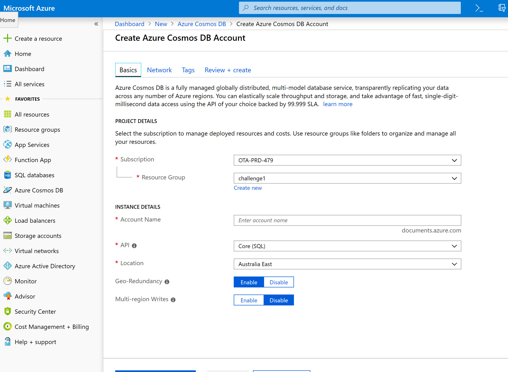

# Getting Started

In this lab, you will create an Azure Cosmos DB account.

## Log-in to the Azure Portal

1. In a new window, sign in to the **Azure Portal** (<http://portal.azure.com>).

1. Once you have logged in, you may be prompted to start a tour of the Azure portal. You can safely skip this step.

## Create Azure Cosmos DB Resource

> You will now create an Azure Cosmos DB account to use in the remaining labs.

### Create Azure Cosmos DB Account

1. On the left side of the portal, click the **Create a resource** link.

    

1. At the top of the **New** blade, locate the **Search the Marketplace** field.

    

1. Enter the text **Cosmos** into the search field and press **Enter**.

1. In the **Everything** search results blade, select the **Azure Cosmos DB** result.

    

1. In the **Azure Cosmos DB** blade, click the **Create** button.

    

1. In the new **Create Azure Cosmos DB Account** blade, perform the following actions:

    1. Leave the **Subscription** list set to its default value.

    1. In the **Resource group** section, click the **Create new** button.
    
    1. In the **Resource group** section, enter the value **cosmosgroup-lab** into the field.

    1. In the **Account Name** field, enter a globally unique value. This will be used to create the URI endpoint for your account.

    1. In the **API** list, select the **Core (SQL))** option.

    1. In the **Location** list, select the **West US** option.

    1. Ensure the **Geo-redundancy** option is set to **Enable**.

        > This option creates a replicated version of your database in a second (paired) region.

    1. Ensure the **Multi-region Writes** option is set to **Disable**.

        > With Azure Cosmos DB multi-master support, you can perform writes on containers of data (for example, collections, graphs, tables) distributed anywhere in the world. You can update data in any region that is associated with your database account. These data updates can propagate asynchronously. 

    1. Click the **Review + create** button.

        

    1. After your settings are validated, click the **Create** button to begin the deployment of an Azure Cosmos DB account resource.

        

1. The deployment blade will appear with details about your deployment.

    

1. Wait for the deployment task to complete before completing this lab.

    > Deployment can take up to ten minutes.

    