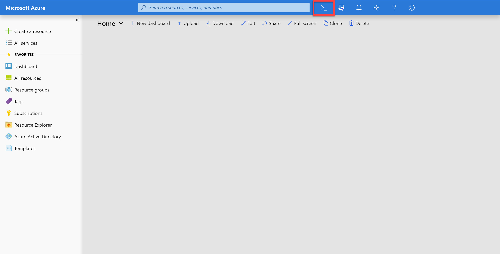

# Cleaning Up

In this lab, you will remove the resource group containing your Azure Cosmos DB account.

## Removing Lab Assets

*In many Azure scenarios, your entire application solution is grouped into an Azure resource group. You will use the Cloud Shell tool in the Azure Portal to list all of your resource groups and then delete the resource group you used for these labs.*

### Open Cloud Shell

1. At the top of the portal, click the **Cloud Shell** icon to open a new shell instance.

    

    > If this is your first time using the cloud shell, you may need to configure the default Storage account and SMB file share. For this lab, you should select **Bash (Linux)** as your environment and your default subscription for the mounted storage share. Once you click **Create storage**, a new **Azure Storage** account will be created with a SMB file share for any files you may create in the Bash shell. TO learn more about the Cloud Shell, refer to [/docs.microsoft.com/azure/cloud-shell/overview](https://docs.microsoft.com/en-us/azure/cloud-shell/overview).

### Use Azure CLI to Delete Resource Group

1. In the **Cloud Shell** command prompt at the bottom of the portal, type in the following command and press **Enter** to list all resource groups in the subscription:

    ```sh
    az group list
    ```

1. Type in the following command and press **Enter** to delete the **LABMPAR** *Resource Group*:

    ```sh
    az group delete --name "cosmosgroup-lab" --no-wait --yes
    ```

1. Close the **Cloud Shell** prompt at the bottom of the portal.

1. Close your browser application.